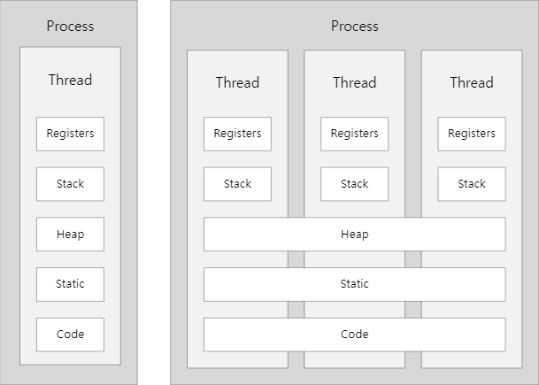
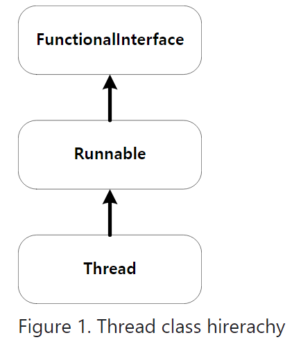

## 프로세스와 스레드



### 프로세스

- 실행중인 프로그램을 의미한다.
- Storage의 프로그램을 실행하면, 실행을 위해 메모리 할당이 이루어지고 할당된 메모리 공간으로 바이너리 코드가 올라간다. 이 순간부터 프로세스라고 불린다.
- 하나 이상의 스레드로 구성된다.

### 스레드

- 프로세스와 유사하지만, 메모리의 많은 부분을 공유한다.
- 스레드별로 Stack과 Register를 가지고 있다.
    - Register에 고유한 정보를 담고 있기 때문에 공유하지 않고 자기 자신만 가지고 있는다.
- 멀티 스레드를 구성할 때는 여러 개를 동시에 돌린다고 생각하지 말고,
  찰나의 순간에는 하나의 스레드가 돌아간다고 생각하고
  공유되는 순간에 어떻게 제약할 지를 생각한다.

일단 스레드 고민 없이, 다른 것에 공유될 수 있다는 것만 생각하고 만들어놓은 뒤에
오류를 잡는다.

### 싱글 스레드

하나의 프로세스에서 오직 하나의 스레드로만 실행된다.

- 단일 레지스터와 스택으로 구성된다.
- Context Switching 작업을 요구하지 않는다.
- 동시성 제어에 대한 처리를 신경쓰지 않아도 된다.

### 멀티 스레드

프로그램 내에서 두 개 이상의 동작을 동시에 실행한다.

또한, 하나의 프로세스를 다수의 실행 단위로 구분하여 자원을 공유한다.

- 프로세서의 활동을 극대화시킬 수 있다.
- 자원의 생성과 관리의 중복성을 최소화하고 수행 능력을 향상시킬 수 있다.

### 프로세스와 스레드의 차이

프로세스는 실행하기 위한 모든 자원들을 개별적으로 가지고 있어 무겁지만,

스레드는 개별적으로 필요한 최소한의 자원들만 가진 경량 프로세스라고 볼 수 있다.

또한 프로세스는 개별 메모리로 인해 프로세스 간 통신이 느리고,

스레드는 공유 메모리를 이용한 직접 통신이 가능해 스레드 간 통신이 빠르다.

## Thread 클래스를 이용한 스레드 구현

자바에서는 Thread 클래스를 확장해서 스레드로 동작하는 클래스를 만들 수 있다.

<details>
    <summary> 1초마다 1씩 증가하는 Counter 클래스 </summary>
  <br />

```java
public class Counter {

    private String name;
    private int maxCount;

    public Counter(String name, int maxCount) {
        this.name = name;
        this.maxCount = maxCount;
    }

    public static void main(String[] args) throws InterruptedException {
        Counter counter1 = new Counter("counter1", 10);
        Counter counter2 = new Counter("counter2", 10);
        counter1.run();
        counter2.run();
    }

    public void run() throws InterruptedException {
        int count = 1;
        while (maxCount-- > 0) {
            System.out.println(name + " : " + count++);
            Thread.sleep(1000);
        }
    }
}
```

</details>

<details>
    <summary> Thread를 이용한 1초마다 1씩 증가하는 Counter 클래스 </summary>
  <br />

```java
public class ThreadCounter extends Thread {

    private String name;
    private int maxCount;

    public ThreadCounter(String name, int maxCount) {
        this.name = name;
        this.maxCount = maxCount;
    }

    public static void main(String[] args) throws InterruptedException {
        ThreadCounter counter1 = new ThreadCounter("counter1", 10);
        ThreadCounter counter2 = new ThreadCounter("counter2", 10);
        counter1.start();
        counter2.start();
        // counter.join();
    }

    @Override
    public void run() {
        int count = 0;
        while (maxCount-- > 0) {
            try {
                System.out.println(name + " : " + ++count);
                sleep(1000);
            } catch (InterruptedException e) {
                throw new RuntimeException(e);
            }
        }
    }
}
```
</details>

## Runnable 인터페이스를 이용한 스레드 구현
스레드는 어제 배운 Thread 클래스 말고도 Runnable 인터페이스를 통해서 구현할 수 있다.

Runnable 인터페이스는 Thread 클래스를 이용해 실행할 수 있도록 필요한 기능을 메서드로 선언하고 있을 뿐,
실제 실행을 위해서는 별도의 Thread 클래스를 이용한 객체 생성이 필요하다.

<details>
    <summary> Runnable 인터페이스를 이용한 RunnableCounter </summary>
  <br />

```java
public class RunnableCounter implements Runnable {

    private static int commonCount = 0;
    private String name;
    private int maxCount;

    public RunnableCounter(String name, int maxCount) {
        this.name = name;
        this.maxCount = maxCount;
    }

    public static void main(String[] args) throws InterruptedException {
        RunnableCounter counter = new RunnableCounter("counter", 5);
        Thread thread = new Thread(counter);
        thread.start();
    }

    public synchronized void incrementCommonCount() {
        commonCount++;
    }

    @Override
    public void run() {
        int count = 0;
        while (!Thread.currentThread().isInterrupted() && (count < maxCount)) {
            count++;
            System.out.println(name + " : " + count);
            try {
                Thread.sleep(1000);
            } catch (InterruptedException e) {
                System.out.println("stopped");
            }
        }
    }

    public void stop() {
        Thread.currentThread().interrupt();
    }

}
```
```java
public class ExecuteRunnableCounter implements Runnable {

    private int count;
    private int maxCount;
    private String name;

    private Thread thread;

    public ExecuteRunnableCounter(String name, int maxCount) {
        this.maxCount = maxCount;
        count = 0;
        thread = new Thread(this, name);
    }

    public static void main(String[] args) throws InterruptedException {
        ExecutorService pool = Executors.newFixedThreadPool(2);
        pool.execute(new RunnableCounter("counter1", 5));
        pool.execute(new RunnableCounter("counter2", 5));

    }

    @Override
    public void run() {
        while (count < maxCount) {
            try {
                count++;
                System.out.println(thread.getName() + " : " + count);
                Thread.sleep(1000);
            } catch (InterruptedException e) {
                Thread.currentThread().interrupt();
            }
        }
    }
}
```
</details>

## Runnable 인터페이스와 Thread 클래스의 차이
Thread 클래스와 Runnable 인터페이스의 차이는 class의 상속과 interface의 구현의 차이를 구분하면서 알 수 있다.
### Class 확장
- 다중 상속을 지원하지 않아 다른 클래스로부터 추가적인 확장이 불가능하다.
- 인스턴스 생성 수 바로 실행할 수 있다.
- 간단한 클래스여도 별도의 정의가 필요하다.

### Interface 구현
- 다중 상속이 지원되고, 구현된 후에도 해당 클래스의 확장이 가능하다.
- 인스턴스 생성 후 바로 실행할 수 없고, 추가적인 스레드 객체가 요구된다.
- Runnable 인터페이스는 함수형 인터페이스를 통해 람다로 구현이 가능하다.