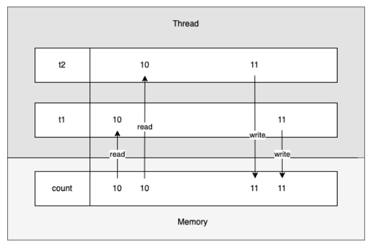
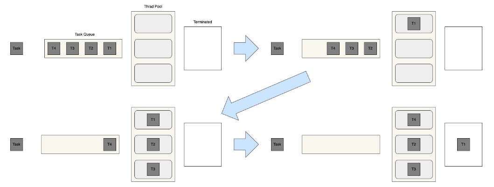

## Thread 멈추기
Java의 스레드는 start()에 의해 시작되지만, 종료에 대한 명령이 없다. 

정확히는 초기 버전에서는 stop()을 지원하였으나, 현재는 안전성을 이유로 사용하지 않을 것을 권장한다.

stop()은 스레드를 즉시 중단시키는 메서드로서, 스레드가 실행 중인 상태에서 강제로 종료시켜 스레드 내부에서 리소스 정리를 제대로 할 수 없게 되고, 이로 인해 프로그램이 예기치 않게 동작할 수도 있다.

또한, stop()으로 lock을 해제하지 않은 채 스레드를 종료시켜 다른 스레드에서 lock 획득을 위해 무한히 기다리는 deadlock 상태에 빠질 수 있다.

Thread를 안전하게 종료하기 위해서는 스레드 내에서 확인 가능할 수 있도록 상태를 전달해 스스로 종료할 수 있게 만들어야 한다.

따라서 다음과 같이 Interrupt 를 활용해서 스레드를 멈추게 한다.
```java
    public void stop() {
    Thread.currentThread().interrupt();
}
```

## Thread 동시성 제어
Thread는 하나의 process내에서 자원을 공유하면서 여러 개가 동시에 실행될 수 있다.

그래서 이에 따라 동기화 문제가 발생할 수 있게 된다.
### Race Condition(경쟁 조건)

Race condition은 둘 이상의 스레드가 동시에 공유 자원 접근 시 발생한다.

첫 번째 스레드가 변수를 읽고 두 번째 스레드도 변수에서 동일한 값을 읽는다.

그런 다음 첫 번째 스레드와 두 번째 스레드는 값에 대한 작업을 수행하고 변수에 마지막으로 값을 쓰기 위해 두 스레드는 경쟁하게 되고
하나의 스레드가 값을 쓰고, 다음 스레드가 값을 덮어쓴다면 마지막에 쓴 스레드의 값이 저장되어 원하는 결과를 얻지 못하게 될 것이다.


<details>
    <summary> 공유 count를 가지게 되면 생기는 Race Condition 문제 </summary>
  <br />

```java
public class SharedCount {
    static int count = 0;

    public static int getCount() {
        return count;
    }

    public synchronized void increment() {
        count++;
        try {
            Thread.sleep(100);
        } catch (InterruptedException ignore) {
        }
    }
}

public class SharedCounter extends Thread {
    SharedCount sharedCount;
    int count;
    int maxCount;

    public SharedCounter(String name, int maxCount, SharedCount sharedCount) {
        setName(name);
        this.sharedCount = sharedCount;
        this.maxCount = maxCount;
        count = 0;
    }

    @Override
    public void run() {
        while (count < maxCount) {
            count++;
            synchronized (sharedCount) {
                sharedCount.increment();
            }
        }
    }
}
```
</details>


### Deadlock(교착 상태)
데드락은 자원 접근 권한 획득과 자원 접근 반환 관계의 꼬임으로 발생하게 된다.

앞선 리소스 권한을 얻기 위해 대기하고 있는 상태에서 다른 프로세스가 리소스 접근 권한을 기다리고 있을 때
무한 대기 상태에 빠지는 점유 대기와, 서로가 가지고 있는 리소스의 접근 권한을 대기하고 있는 순환 대기 상태가 있다.

### Synchronized 동기화
Java에서는 스레드 동기화를 위해 `Synchronized` 를 적용할 수 있다.

`Synchronized`는 각각 Instance method에서, code block에서,

static method에서 선언이 가능하다.

동기화를 사용해서 하나의 스레드만 작업을 하고 다른 스레드에는 lock을 걸어놓을 때,

해야 할 작업이 많다면 기다리는 시간에 대한 처리가 필요하게 된다.

Java는 이런 상황에 `wait()`와 `notify()`를 제공한다.

스레드가 들어와서 일을 다 한 뒤 `wait()`을 걸어주면 대기 공간에 들어가게 되고,

`notify()` 를 할 때까지 대기하게 된다.

그렇게 `wait()`을 걸어주면 다른 스레드가 들어와서 작업을 할 수 있게 된다.

## 스레드 상태
스레드는 아래와 같은 생명 주기를 가질 수 있다.


| 상태            | 설명                                         |
|---------------|--------------------------------------------|
| NEW           | 스레드가 실행 준비를 완료한 상태로, start() 함수를 호출하기 전 상태 |
| RUNNABLE      | start()가 호출되어 실행될 수 있는 상태                  |
| RUNNING       | 해당 스레드가 동작중인 상태                            |
| WAITING       | 다른 스레드가 통지할 때까지 기다리는 상태                    |
| TIMED_WAITING | 정해진 시간 동안 기다리는 상태                          |
| BLOCKED       | 사용하고자 하는 객체의 잠금(lock)이 풀릴 때까지 대기하는 상태      |
| TERMINATED    | 실행이 종료된 상태                                 |


## 스레드 풀



Java에서 스레드 풀은 여러 개의 스레드를 만들어 두고 만들어 여러 번 재사용되는 작업자 스레드 그룹을 나타낸다.

고정 크기로 생성된 스레드 풀에 Runnable 객체를 주고 실행을 요청하면, 스레드 풀에서 스레드를 가져와 실행시킨다. 만약 스레드 풀에 남아 있는 스레드가 없다면, 유휴 스레드가 생길 때까지 해당 작업은 실행되지 못하고 대기상태에 있게 된다.

실행 중이던 스레드는 작업이 완료되면 다시 스레드 풀로 돌아오게 되고, 대기 중인 작업이 있는 경우 다시 실행하게 된다.

