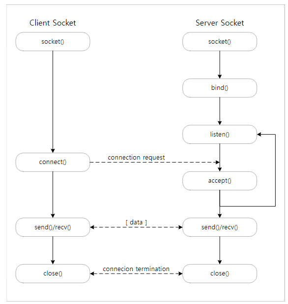
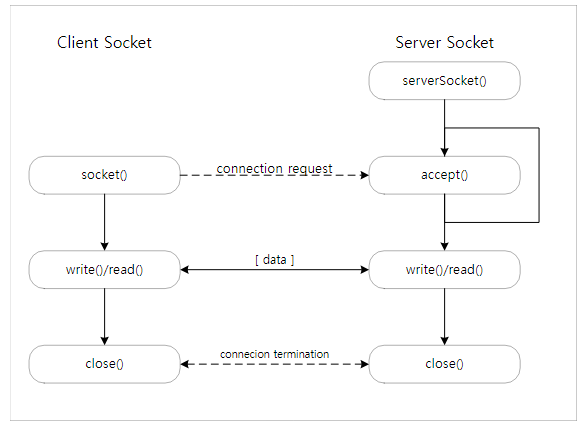

## Java Network Programming
### Socket
네트워크를 통해 데이터를 주고 받기 위한 엔드포인트.

일반적으로 socket 통신은 네트워크 상에서 사용되는 network socket을 의미한다.

소켓은 Datagram Sockets와 Stream sockets로 나뉜다.

**Datagram Sockets**

- UDP를 사용하는 무연결 socket
- Datagram socket에서 보내거나 받은 패킷은 개별적으로 주소가 지정되고 라우팅된다.
    - 순서와 신뢰성이 보장되지 않으므로 전송되는 여러 패킷이 임의의 순서로 도착하거나 전혀 도착하지 않을 수 있다.

 **Stream Sockets**

- TCP, SCTP, DCCP 등을 사용한다.
- 신뢰성과 흐름 제어 보장
- 인터넷에서 일반적으로 TCP를 사용하여 구현되므로,

  응용 프로그램이 TCP/IP 프로토콜을 사용하여 네트워크를 통해 실행될 수 있음

### Socket 통신


서버와 클라이언트가 필요하고,

다중 접속을 허용할 경우에는 개별 접속마다 별도의 통신 관리가 필요하다.

Server socket의 동작 과정은 다음과 같다.

- socket() 함수를 이용하여 소켓 생성
- bind() 함수를 이용해 대기 소켓의 IP 주소와 port를 설정
- listen() 함수로 클라이언트 소켓 연결 요청 대기
- Client socket 연결 요청이 오면 accept() 함수를 이용해 연결을 승인하고, 요청은 client socket과 통신을 위한 소켓을 생성
- Server socket은 listen() 함수를 통해 추가적인 연결 요청에 대비하고, 생성된 socket은 연결된 client socket과 데이터를 주고받음
- Client socket이나 생성된 socket을 닫으면 연결되어 있던 상대 socket도 닫힘

## Java에서의 소켓 활용
Java에서는 socket 통신을 위해 Socket class와 서버 구성을 위한 ServerSocket class를 지원하며, 아래와 같이 동작한다.

앞서의 소켓 통신과 크게 다르지 않지만, 불필요하게 나눠져 있던 과정을 단순화 시켜 처리할 수 있다.

<details>
    <summary> Client socket을 이용해 서버 연결 </summary>
  <br />

```java
public class Exam01 {

    public static void main(String[] args) {
        try {
            Socket socket = new Socket("180.210.81.192", 12345);
            System.out.println("서버에 연결되었습니다.");
            socket.getOutputStream().write("hello".getBytes());
            byte[] buffer = new byte[256];
            int length = socket.getInputStream().read(buffer);
            System.out.println("Received : " + length);
            System.out.println("Data : " + Arrays.toString(Arrays.copyOf(buffer, length)));
            socket.close();
        } catch (IOException e) {
            System.err.println(e);
        }
    }
}

```
</details>

### 자원 관리하기
컴퓨터는 유한한 자원을 가지고 운영된다. 따라서, 컴퓨터에서 운영되는 프로그램을 만들때 주의해야 할 점 중 하나가 자원 관리 문제이다.

Socket은 유한한 자원 중 하나로 생성 가능한 수가 제한되어 있고, 필요시 조정 가능하다.

<details>
    <summary>  try-with-resources를 이용해 socket 자원 관리. </summary>
  <br />

```java
public class Quiz02 {

    public static void main(String[] args) {
        byte[] buffer;
        int length;
        try (Socket socket = new Socket("180.210.81.192", 12345)) {
            System.out.println("서버에 연결되었습니다.");
            socket.getOutputStream().write("hello".getBytes());
            buffer = new byte[256];
            length = socket.getInputStream().read(buffer);
        } catch (IOException e) {
            throw new RuntimeException(e);
        }
        System.out.println("Received : " + length);
        System.out.println("Data : " + Arrays.toString(Arrays.copyOf(buffer, length)));
    }
}
```
</details>

### 데이터 송수신
데이터는 socket의 outputstream을 통해 데이터를 보내고, inputstream을 통해 데이터를 받을수 있다.

<details>
    <summary>  Client socket을 서버에 연결해 데이터를 보내기 </summary>
  <br />

```java
public class Quiz04 {

    public static void main(String[] args) {
        String host = "180.210.81.192";
        int port = 12345;
        try (Socket socket = new Socket(host, port); Scanner scanner = new Scanner(System.in)) {
            System.out.println("서버에 연결되었습니다.");
            System.out.print("문자열을 입력해주세요. : ");
            String text = scanner.nextLine();
            if (text.equals("exit")) {
                System.out.println("프로그램을 종료합니다.");
                System.exit(0);
            }
            socket.getOutputStream().write(text.getBytes());
            System.out.println("전송이 완료되었습니다.");
        } catch (IOException e) {
            System.err.println(host + ":" + port + "에 연결할 수 없습니다.");
        }
    }
}
```
</details>

<details>
    <summary>  Client socket을 서버에 연결해 데이터를 받아오기 </summary>
  <br />

```java
public class Quiz05 {

    public static void main(String[] args) {
        String host = "180.210.81.192";
        int port = 12345;
        try (Socket socket = new Socket(host, port)) {
            System.out.println("서버에 연결되었습니다.");
            BufferedInputStream inputStream = new BufferedInputStream(socket.getInputStream());
            byte[] buffer = new byte[1024];
            int bytes;

            StringBuilder sb = new StringBuilder();
            while ((bytes = inputStream.read(buffer)) != -1) {
                sb.append(new String(buffer, 0, bytes));
            }

            String input = sb.toString();
            if (input.equals("exit")) {
                System.out.println("프로그램을 종료합니다.");
                System.exit(0);
            }
            System.out.println("받은 문자열 : " + input);
        } catch (IOException e) {
            System.err.println(host + ":" + port + "에 연결할 수 없습니다.");
        }
    }
}
```
</details>