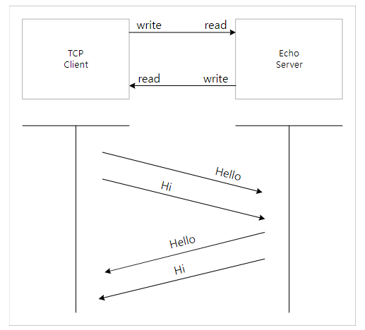
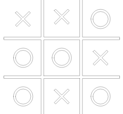

## Echo server를 통해 메시지 송수신하기
Echo server는 아래 그림과 같이 클라이언트가 서버에 연결하여 메시지를 보내면,

서버에서는 그 메시지를 받아서 그대로 돌려준다.


<details>
    <summary> Echo server를 이용한 문자열 송수신</summary>
  <br />

```java
public class EchoServer extends Thread {
    String id = "";
    List<EchoServer> echoServers;
    byte[] buffer = new byte[256];
    BufferedReader bufferedInput;
    BufferedOutputStream bufferedOutput;
    private boolean running;

    public EchoServer(InputStream input, OutputStream output, List<EchoServer> echoServers) {
        this.bufferedInput = new BufferedReader(new InputStreamReader(input));
        this.bufferedOutput = new BufferedOutputStream(output);
        this.echoServers = echoServers;
        running = false;
    }

    public String getClientId() {
        return id;
    }

    public void setClientId(String id) {
        if ((id == null) || id.isEmpty()) {
            throw new IllegalArgumentException();
        }
        this.id = id;
    }

    @Override
    public void run() {


        running = true;
        while (running) {
            try {
                String message = bufferedInput.readLine();
                System.out.println("Receive : " + message);
                if (message.charAt(0) == '#' && message.length() > 1) {
                    String id = message.substring(1);
                    setClientId(id);
                } else if (message.charAt(0) == '@' && message.length() > 1) {
                    String[] fields = message.split(" ", 2);
                    String targetId = fields[0].substring(1);

                    for (EchoServer echoServer : echoServers) {
                        if (targetId.equals(echoServer.getClientId())) {
                            echoServer.write(fields[1]);
                        }
                    }
                }  else if (!id.isEmpty()) {
                    message += " from " + id;
                    System.out.println("Echo : " + message);
                    for (EchoServer echoServer : echoServers) {
                        echoServer.write(message);
                    }
                }
            } catch (IOException e) {
                running = false;
            }
        }
    }

    public void stop2() {
        running = false;
    }

    public void write(String message) {
        try {
            bufferedOutput.write(message.getBytes());
            bufferedOutput.flush();
        } catch (IOException e) {
            stop2();
        }
    }
}
```
</details>

## 비동기 통신 만들기


지금까지 구현한 소켓은 클라이언트에서  데이터를 보내야지만, 다시 받을 수 있도록 되어 있다.

Echo server의 경우, 보낸 데이터를 그대로 돌려줌으로써 소켓 쓰고 읽는 과정을 순서대로 반복하는 방식이다.

이것은 두 가지 과정에 독립적으로 동작해야 하는 것으로 스레드를 이용해 두 과정이 따로 동작할 수 있도록 구성하면 비동기 통신이 가능하다.

<details>
    <summary> Thread를 활용해 비동기 통신 구현하기 </summary>
  <br />

```java
public class Async {

    public static void main(String[] args) throws InterruptedException {

        String host = "localhost";
        int port = 12345;
        try {
            Socket socket = new Socket(host, port);
            System.out.println("서버에 연결되었습니다.");
            BufferedInputStream input = new BufferedInputStream(socket.getInputStream());
            BufferedOutputStream output = new BufferedOutputStream(socket.getOutputStream());
            
            Thread receiver = new Thread(() -> {
                byte[] buffer = new byte[256];
                boolean running = true;
                while (running) {
                    try {
                        System.out.println("Wait message");
                        int length = input.read(buffer, 0, buffer.length);
                        if (length != -1) {
                            String message = new String(Arrays.copyOf(buffer, length));
                            System.out.println(message);
                        } else {
                            running = false;
                        }
                    } catch (IOException e) {
                        System.err.println("Error : " + e.getMessage());
                        running = false;
                    }
                }
            });
            receiver.start();

            Thread sender = new Thread(() -> {
                for (int i = 0; i < 5; i++) {
                    String message = "Hello [ " + i + " ] ";
                    System.out.println("Send : " + message);
                    try {
                        output.write(message.getBytes());
                        output.flush();
                        Thread.sleep(1000);
                    } catch (IOException | InterruptedException e) {
                        throw new RuntimeException(e);
                    }
                }
            });
            sender.start();

            receiver.join();
            sender.join();

            socket.close();
        } catch (UnknownHostException e) {
            System.err.println("호스트를 알 수 없습니다.");
        } catch (IOException e) {
            System.err.println(host + ":" + port + "에 연결할 수 없습니다.");
        }
    }

    static class Receiver extends Thread {

        BufferedInputStream input;
        boolean running = false;

        public Receiver(BufferedInputStream input) throws UnknownHostException, IOException {
            this.input = input;
            setName("receiver");
        }

        public void stop2() {
            running = false;
        }

        @Override
        public void run() {
            byte[] buffer = new byte[256];
            running = true;
            while (running) {
                try {
                    System.out.println("Wait message");
                    int length = input.read(buffer, 0, buffer.length);
                    System.out.println(new String(Arrays.copyOf(buffer, length)));
                } catch (IOException e) {
                    System.err.println("Error : " + e.getMessage());
                    stop2();
                }
            }
        }
    }
}

```
</details>

## 실습과제
### 1. TicTacToe 게임 만들기
   TicTacToe 게임은 두명의 참가자가 3x3 판 위에 X와 O로 표시하여 한줄을 맞추는 매우 단순한 게임이다.

규칙은 다음과 같다.
1. 3x3 칸을 그린다.
2. 참가자 1이 칸을 선택하여 O을 표시한다.
3. 참가자 2가 칸을 선택하여 X를 표시한다.
4. 한줄이 완성되면 이긴 참가자를 표시한다.



**요구 조건**

1. 두명이 참가할 수 있는 TicTacToe 게임을 만들어라.
2. 모두 참가하면, 서버에서는 게임 준비를 알린다.
3. 먼저 시작할 참가자를 정한다.
   - 우선 입장한 참가자가 우선할 수 있다.
   - 두 참가자에게 가위, 바위, 보를 시킬 수 있다.
4. 순서가 정해지면 순서대로 반복한다.
   - 먼저 시작한 참가자가 O을 표시한다.
5. 선택할때마다 게임판 상태를 출력한다.


### 2. snc(simple-nc) 만들기
   **요구 사항**

   nc(netcat)과 유사하게 동작하는 simple-nc를 만들어 본다.

snc는 다음과 같이 동작한다.

**옵션**

-l : server listen port

**Client Mode**

- Argument로 받은 server에 tcp로 연결한다.

- 입력은 표준 입력(System.in)으로 받아서 server에 전송한다.

- 출력은 표준 출력(System.out)을 이용하고, server에서 받은 데이터를 출력한다.

- Client에서 발생하는 에러는 표준 에러(System.err)를 이용해 출력한다.

- ctrl-c로 프로그램을 종료한다.

- 프로그램 종료시 모든 자원은 반납하도록 한다.

**Server Mode**

- Argument로 서비스 제공을 위한 port를 받는다. (옵션 -l)

- 서비스 port로 접속되는 client를 기다린다.

- Client에서 보내는 데이터를 표준 출력(System.out)으로 출력한다.

- 표준 입력(System.in)으로 입력된 데이터를 client로 전송한다.

- Server에서 발생하는 에러는 표준 에러(System.err)를 이용해 출력한다.

- ctrl-c로 프로그램을 종료한다.

- 프로그램 종료시 모든 자원은 반납하도록 한다.

### 실습과제 구현 링크
https://github.com/DJ-BE-5/week01_JeongHyunDo