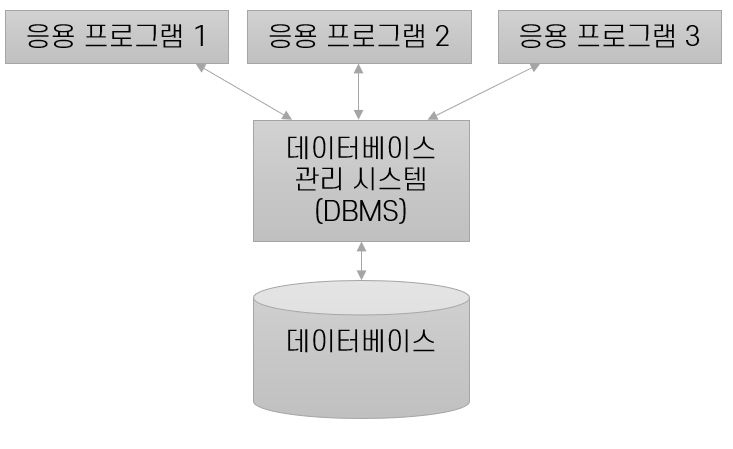

## 데이터베이스 개요

### 데이터베이스 관리 시스템(DBMS)

- 데이터를 유지 관리하고 이용하는데 도움을 주도록 설계된 소프트웨어
- 데이터의 종속성과 중복의 문제를 해결하기 위해 고안된 시스템

### 데이터베이스 관리 시스템의 기능
- **데이터 정의 기능**
    - 논리적 구조와 물리적 구조의 Mapping 명세
- **데이터 조작 기능**
    - 사용자와 데이터베이스 사이의 인터페이스를 위한 수단 제공
- **데이터 제어 기능**
    - 데이터의 CRUD 작업이 정확히 실행되며, 무결성을 제공

### 데이터 모델

- 데이터를 설명하기 위한 표기법
    - 데이터의 구조
    - 데이터에 대한 작업
    - 데이터에 대한 제약 조건
        - 식별자 (Primary Key)

### 데이터 독립성

각 추상화 단계 별로 응용 프로그램의 데이터 구성 및 저장 방식으로부터 격리.

### 릴레이션 스키마

데이터를 어떻게 표현할 지 엔티티와 특성을 나타내는 속성, 관계, 제약조건을 기술한 것을 의미한다.

릴레이션은 릴레이션 스키마와 릴레이션 인스턴스로 이루어진다.

- **관계 데이터베이스 스키마**

  릴레이션을 정의하는 청사진.

  릴레이션의 이름, 각 필드 또는 열 또는 속성의 이름, 각 속성의 도메인을 명세한다.

  도메인 제약은 릴레이션 인스턴스가 지켜야 하는 중요한 조건으로서, 어떤 열의 값은 해당 도메인으로부터 나와야 한다는 것을 의미한다.

- **도메인**

  속성의 값, 타입 제약조건 등에 대한 값의 범위로, 릴레이션 스키마에서는 도메인 이름으로 명세한다.

  하나의 속성이 가질 수 이쓴 동일한 유형의 원자값들의 집합.

- **릴레이션 인스턴스**

  레코드라고도 불리는 튜플의 집합이다.

  릴레이션 스키마에서 정의된 각 속성으로 정의되며, 하나의 데이터 묶음을 나타낸다.

  릴레이션 스키마를 기반으로 실제 데이터가 저장되는 테이블

- **릴레이션 카디널리티**

  한 테이블에 들어가있는 튜플 수를 의미한다.

- **릴레이션 차수**

  레코드의 속성 수를 의미한다.

- 물리적 데이터 독립성과 논리적 데이터 독립성

## SQL

SQL은 관계형 데이터베이스 관리 시스템의 데이터를 관리하기 위해 설계된 특수 목적의 프로그래밍 언어이다. MySQL, Oracle 등이 있다.

SQL을 크게 세분화를 시키면,

- DDL : 데이터를 정의
    - CREATE : 테이블의 생성
    - ALTER : 데이터의 구조 변경
    - DROP : 테이블 삭제
    - RENAME : 테이블 이름 변경
    - COMMENT : 테이블 및 컬럼 주석 추가
    - TRUNCATE : 데이터 초기화
- DML : 데이터를 조작
    - SELECT : 데이터를 조회
    - INSERT : 데이터 삽입
    - UPDATE : 데이터 업데이트
    - DELETE : 데이터 삭제
- DCL : 데이터에 대한 접근
    - GRANT : 데이터 접근 권한 부여
    - REVOKE : 데이터 접근 권한 회수

### 무결성 제약조건

데이터의 신뢰성, 품질을 결정하는 것을 데이터 무결성이라고 하고,

무결성을 지키기 위해서는 제약조건이 필요하다.

관계형 데이터베이스는 `무결성 제약 조건(Integrity Constraint)` 을 사용하여 데이터베이스에 부정확한 데이터가 입력되는 것을 방지한다.

- Legal 인스턴스

  데이터베이스 스키마에 명세된 무결성 제약 조건들을 모두 만족하는 DB 인스턴스

### 개체 무결성

각 개체에 다른 개체들과 구분될 수 있는 정보를 넣어주는 것을 의미한다.

- **슈퍼 키**(Super Key) : 유일성을 만족하는 필드들의 부분집합
- **후보 키**(Candidate Key) : 유일성과 최소성을 만족하는 슈퍼 키 집합의 부분 집합
- **기본 키**(Primary key) : 특정 튜플을 구별하기 위해 후보 키에서 선택된 유일한 식별자