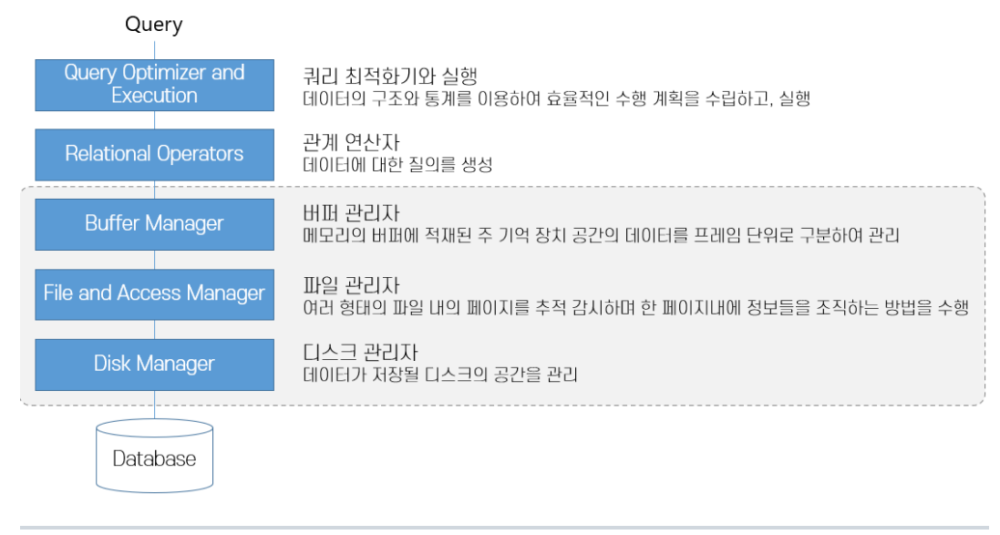
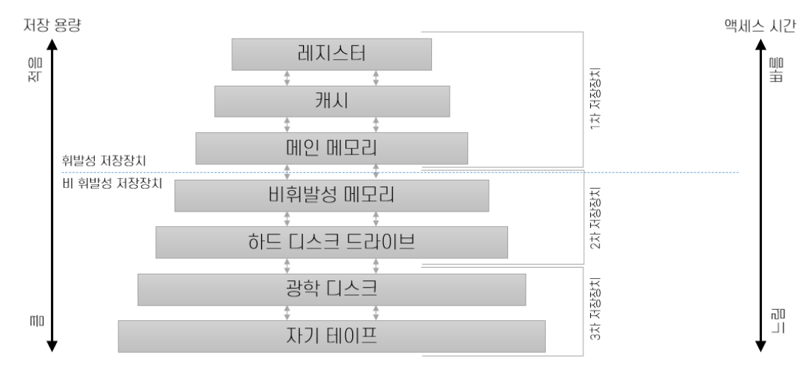

### 참조성 객체 삭제
Foreign Key를 설정할 때 *`on delete cascade`* 를 입력해주면

나중에 `DELETE`를 통해 제약조건이 걸린 컬럼을 삭제할 수 있고,

그와 연관된 레코드들까지 한번에 삭제된다.

또는 *`on delete set null`* 로 설정해주면 연관된 레코드들은 Null로 채워지게 된다.

```sql
alter table product
add constraint fk_product_category foreign key (category_num)
references category (category_num) on delete set null;

// 연관된 레코드 null로 채워짐
alter table product
add constraint fk_product_category foreign key (category_num)
references category (category_num) on delete cascade;

delete from category where category_num = 2;

insert into product (product_num, product_name, price, category_num)
values (2312111, 'Cosmos', 28800, 2);

insert into category
values (2, 'Science');
```

## 디스크와 파일

SQL 쿼리문을 날렸을 때,

쿼리 최적화기와 실행 → 관계 연산자 → 버퍼 관리자 → 파일 관리자 → 디스크 관리자

의 순서를 거쳐 데이터베이스로 보내진다.
### 기억장치 계층 구조

최 상위 계층에는 레지스터와 캐시, 주 기억장치로 구성되는 1차 저장장치(Primary Storage)가 있는데 
매우 빠른 액세스를 제공한다. 

두 번째 계층은 2차 저장장치(Secondary Storage)로, SSD, 자기 디스크와 같은 상대적으로 느린 저장장치로 구성되며, 

마지막의 3차 저장장치(Tertiary Storage)는 가장 느린 저장장치로서 테이프 등이 해당된다.

상위 계층으로 갈 수록 속도는 빠르지만 비용이 배우 비싸다.

### 버퍼 풀
대부분의 DB는 주 기억장치보다 큰 용량을 가진다. 
CPU는 메모리에 적재된 데이터만을 처리할 수 있으므로, 
DBMS는 필요할 때마다 데이터를 주 기억장치에 적재해야 하며, 
언제 페이지를 교체해야 하는지를 결정해야 한다. 

버퍼 관리자는 필요할 때 마다 디스크로부터 페이지를 가져와서 주 기억장치에 적재해준다.

버퍼 풀은 주 기억장치 공간을 페이지라는 단위로 분할하여 데이터를 적재한다.


이런 페이지가 모여 있는 공간을 **버퍼 풀**이라고 하고, 버퍼 풀 내의 페이지를 **프레임**이라고 한다.

이러한 버퍼 풀에서 사용되지 않는 페이지 중 어떤 페이지를 교체할 지 정하는 알고리즘에 따라 DB의 연산 시간이 달라지게 되고,
대표적인 교체 전략은 LRU, Clock 등이 있다.

## 레코드와 페이지
버퍼 풀과 버퍼 관리자를 통해 전달받은 페이지 내의 데이터는 레코드의 형식으로 구성된다.
레코드는 고정 길이 레코드와 가변 길이 레코드로 구분된다.

페이지는 버퍼 풀에 저장되는 레코드의 집합이며, 디스크에서 메모리로 데이터가 전송되는 최소 단위이다.

## 파일과 인덱스
페이지가 파일에서 조직되는 형태에 따라 데이터베이스의 성질과 속도가 달라진다.

### 힙(Heap)
가장 간단한 파일 구조로, 레코드가 파일의 빈 공간에 순서 없이 저장된다.

페이지 내의 데이터가 어떠한 형태로도 정렬되지 않아서 위치를 알아내려면 모든 인덱스를 스캔해야한다.

rid를 주고 파일을 선택하여 가져오거나 삭제할 때는 레코드 번호를 보면 

해당 레코드가 있는 페이지의 번호를 알아낼 수 있다.

### ISAM
색인 순차 접근 방식(Indexed Sequential Access Method) 파일
데이터를 순서대로 저장하거나 특정 항목을 색인으로 처리할 수 있는 파일 처리 방법이다.

인덱스를 순차적으로 구성하여 큰 인덱스의 성능 문제를 해결한다.
- 인덱스 파일이 클 경우, 인덱스를 계층화하여 인덱스에 대한 인덱스를 구성

### B+ Tree
ISAM 인덱스와 같이 정적인 구조는 파일이 커짐에 따라 성능 저하를 일으키는 문제를 가지고 있기 때문에,
B+ 트리는 트리에서 삽입 삭제를 수행해도 트리의 균형이 유지되고, 트리가 동적으로 커지고 작아지기 때문에 ISAM보다 우수한 평가를 받는다.
