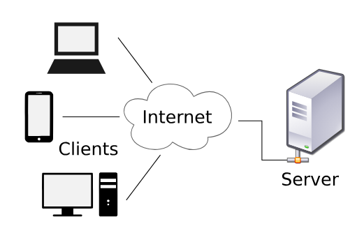
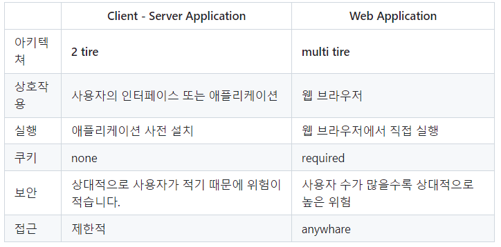
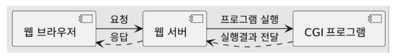
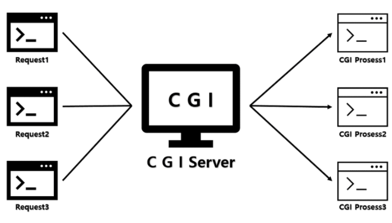
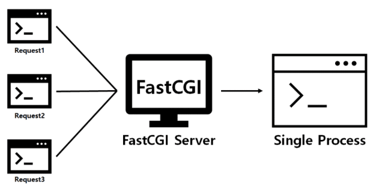
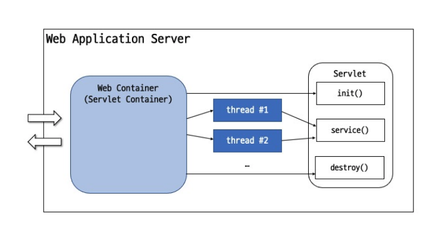
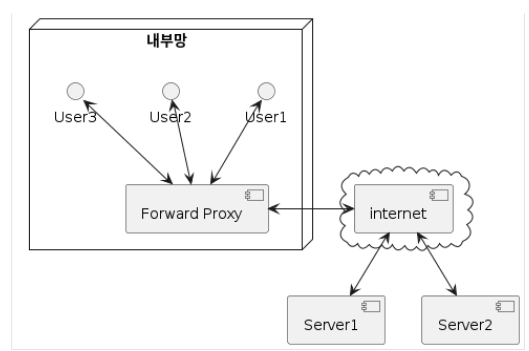
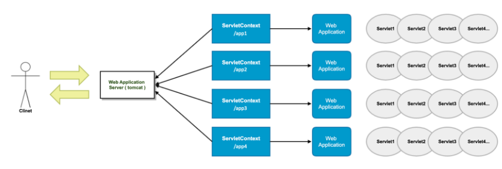
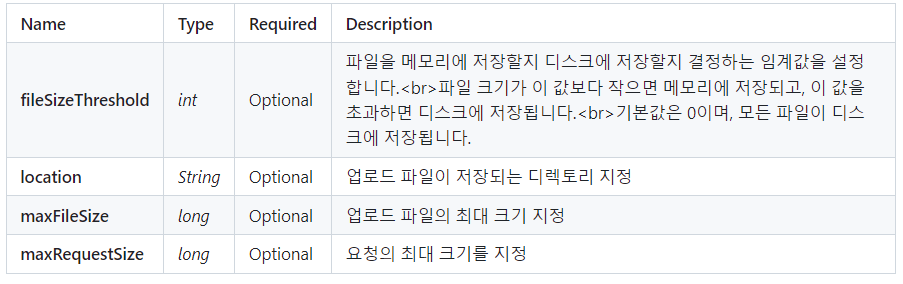

## Web Application
웹 브라우저에서 사용할 수 있는 프로그램.

### Client - Server Architecture



Client - Server 구조로 이루어진다.

**Server**

서버는 클라이언트가 요청한 서비스를 제공한다.


**Client**

클라이언트는 서비스를 사용하는 사용자 혹은 사용자의 단말기 역할을 한다.

ex)

- 메일 서버

- 파일 서버

  - 중앙에 위치하면 저장된 파일은 여러 사용자가 접근할 수 있다.<br>
    ( ex. 구글 드라이브, 두레이 드라이브)

- 웹 서버
  - 인터넷을 통해 다양한 웹사이트를 제공

### Web Application Architecture
애플리케이션 구성 요소, 미들웨어 시스템, 사용자 인터페이스 및 DB 간의 상호작용을 표시하는 골격 또는 레이아웃을 의미한다.

데이터가 HTTP를 통해 전달하는 방식을 정의하고, 클라이언트와 백엔드 서버가 서로 통신할 수 있도록 한다.

**구성요소**

- 웹 브라우저

  - HTML 문서

  - 이미지 파일 (jpg, png, gif..)

  - javascript ( 객체 )

- 웹 서버
  - apache

  - nginx

- 데이터베이스 서버

  - mysql

  - mariadb
  - oracle 등

### Client - Server 구조와 Web Application 구조의 차이


## CGI
Common Gateway Interface로, 웹 서버가 외부 프로그램을 실행할 수 있도록 해주는 인터페이스를 의미한다.



**장점**
- 언어, 플랫폼에 독립적이다.
- 구조가 단순하고 다른 서버 사이드 프로그래밍 언어에 비해 쉽게 수행된다.

**단점**
- 속도가 느리다.
  - 매 요청마다 DB 연결을 새로 열어야 한다.
- HTTP 요청마다 새로운 프로세스를 만들어 서버 메모리를 사용한다.



### Java CGI 프로그램
자바 JVM으로는 웹서버와 자바 어플리케이션 간의 통신을 할 수 없기 때문에,
웹 서버와 자바 어플리케이션 사이에서 서로 통신할 수 있도록 하는 JCGI가 존재한다.

**Java CGI의 문제점**
- 별도의 스크립터가 필요하다.
- 환경변수를 명시적으로 Java 프로그램에 넘겨줘야 한다.

### Fast CGI
웹 서버와 CGI 통신 시 발생하는 부하를 줄임으로써 서버가 한 번에 더 많은 웹페이지 요청을 관리할 수 있도록 만들어졌다.
Apache, Nginx 등이 FastCGI를 제공한다.



자바에서는 Web Application Server인 `Tomcat`을 사용한다.

## Servlet

Java를 사용하여 동적 웹 콘텐츠를 생성하는 서버 측 프로그램
자바로 만든 CGI 프로그램 같은 거라고 생각하면 된다.

CGI의 요청마다 새로운 프로세스가 생성된다는 문제점을 멀티 스레드로 해결하고,
컨테이너로 스레드를 생성하고 관리한다.

### Servlet 서버 구조


서블릿 컨테이너는 서블릿의 생명주기를 관리하고, URL과 특정 서블릿을 맵핑하며 URL 요청을 처리한다.

### Java EE
Java 언어 플랫폼 중에 하나로, 특정 운영체제와 미들웨어에 종속되지 않고 정보 교환 및 어플리케이션 호환이 가능한
플랫폼을 제공하기 위해 만들어졌다.

**Java 언어 플랫폼의 종류**
- Java SE ( Standard Edition )
  
  일반적인 응용 프로그램 개발 용도
- Jave EE ( Enterprise Edition )

  Java SE를 확장하여 분산 컴퓨팅, 웹서비스와 같은 엔터프라이즈 환경을 지원한다.
- Jakarta EE

  2017년 Jave EE 8 릴리스를 마지막으로 오픈소스 SW를 지원하는 Eclipse 재단에 Java EE 프로젝트를 이관하여
  만들어졌다.

## Web Application Server
정적 웹 컨텐츠를 처리하는 웹 서버와 달리 동적 웹 컨텐츠를 생성하기 위한 웹 어플리케이션과 서버 환경을 만들어 동작시키는 기능을 제공한다.
서블릿 컨테이너와 같은 개념이라고 생각하면 되고, WAS라고도 불리운다.

### tomcat
Apache에서 만든 Web Application Server 중에 하나로, Servlet Container의 레퍼런스가 구현되어있다.

사실상 Servlet Container = WAS = tomcat 이라고 생각하면 된다.

## Web Server와 WAS 연동
### Proxy
자원을 요청하는 클라이언트와 서버 사이에서 중재자 역할을 하는 서버 프로그램이다.
- **Forward Proxy**
  
  사용자의 요청을 실제 서버가 받는 것이 아니라 중간에서 Forward Proxy 서버가 대신 요청받아 실제 서버에 연결하고,
  그 결과를 클라이언트에 전달하는 역할을 한다.
  클라이언트의 요청을 바로 받아서 전달해주는 역할이다.
  - 캐싱을 통한 성능 향상
  - 웹 사용 환경 제한을 통한 보안 강화
  
  
- **Reverse Proxy**
  
  클라이언트 앞에 있던 포워드 프록시와 달리 웹서버/WAS 앞에 놓여있는 프록시를 의미한다.
  클라이언트는 요청을 웹 서버가 아닌 프록시에 요청하게 되고 프록시가 뒤에 서버로부터 데이터를 가져와 응답해준다.
  내부 네트워크와 외부 네트워크 사이의 공간을 DMZ라고 부르는데, 이 부분에 리버스 프록시를 두고 실제 서비스 서버는
  내부망에 위치시켜 사용하는 방식이 일반적이다.
  - 로드 밸런싱
    - 리버스 프록시 서버를 여러개의 본 서버들과 연결해두고, 특정 서버가 과부화되지 않게 조절해줄 수 있다.
  - 본래 서버의 주소 IP를 노출시키지 않아 서버 보안을 향상시킬 수 있다.

### Forward Proxy와 Reverse Proxy의 차이점
**프록시 서버 위치**

- Forward Proxy 서버는 클라이언트 앞에 놓여져 있는 반면,
- Reverse Proxy 서버는 웹서버/WAS 앞에 놓여 있다는 차이점이 있다.

**프록시 서버 통신 대상**

- Forward Proxy는 내부망에서 클라이언트와 Proxy 서버가 통신하여 인터넷을 통해 외부에서 데이터를 가져온다.
- Reverse Proxy는 내부망에서 Proxy 서버와 내부망서버가 통신하여 인터넷을 통해 요청이 들어오면 Proxy 서버가 받아 응답해준다.

**감춰지는 대상**

- Forward Proxy는 직접 서버 url로 요청을 보내지만, Reverse Proxy는 프록시 서버 url로만 접근이 가능하다.이로서 Reverse Proxy는 본서버의 IP 정보를 숨길수 있는 효과를 얻게 된다.
- Forward Proxy는 내부망에서 인터넷 상에 있는 서버에 요청할때 먼저 포워드 프록시 서버를 호출하고 프록시가 서버에게 요청을 보내게 되는데, 이로서 서버에게 클라이언트가 누구인지 감출수 있다. 즉, 서버 입장에서 응답받은 IP는 포워드 Forward Proxy의 IP이기 때문에 클라이언트가 누군지 알 수 없다.

### Load-on-startup

서블릿은 브라우저 최초 요청시 init() 메서드 과정을 통해서 메모리에 로드되어 기능을 수행한다.
따라서 최초 요청에 대해서 실행시간이 길어질 수 있는 단점이 있다.

이를 보완하기 위해 load-on-startup이 등장했는데,
0보다 크면 tomcat container가 미리 서블릿을 초기화하고,
숫자의 순서에 의해서 초기화된다.

## Servlet LifeCycle
### init() 메서드
서블릿 컨테이너가 서블릿을 생성한 후 초기화 작업을 수행하기 위해 호출하는 메서드.

클라이언트의 요청을 처리하기 전에 준비할 작업이 있는 경우 여기에서 처리한다.

ex.) 데이터베이스 접속, 외부 스토리지 연결, property 로딩 등


### doXXX() 메서드
GET, POST, PUT, DELETE 각각의 HTTP Method 에 대해

구현이 필요한 doXXX() 메서드 override 해서 구현한다.

### destroy() 메서드

Servlet Container가 종료되거나 해당 서블릿을 비활성화시킬 때 호출

서비스 수행을 위해 확보되었던 자원 해제, 데이터 저장등의 마무리 작업 시 여기에서 처리

ex.) 데이터베이스 연결 종료

### ServletContext
Servlet container 실행 환경을 의미한다.
서블릿과 서블릿 컨테이너 간의 연동을 위해 사용하고, 웹 어플리케이션 하나마다 하나의 ServletContext가 생긴다.


하나의 웹 어플리케이션에 포함된 서블릿들은 같은 ServletContext를 공유한다.
서블릿 컨테이너 실행 시 같이 생성되고, 종료 시 같이 소멸된다.




**ServletContext의 기능**
- 환경 정보 제공 (servlet version, context path 등)
- 설정 정보 제공 (init param, attribute 등)
- Servlet / Filter / Listener 등록
- Servlet에서의 파일 접근
## web.xml
웹 애플리케이션의 배치 정보를 담고 있는 xml 파일이다.
`/WEB-INF/` 디렉터리 하위에 위치한다.
`<web-app>` 이라는 하나의 태그 하위로 설정을 써놓는다.
### web-app 하위 태그들
- Servlet: Servlet 등록 정보

  - servlet-name: Servlet 이름

  - servlet-class: Servlet class의 클래스명

  - init-param: Servlet의 초기 파라미터

  - param-name

  - param-value

  - load-on-startup: 웹 애플리케이션 구동 시 로딩 여부

- servlet-mapping : Servlet과 URL 맵핑 정보

  - servlet-name

  - url-pattern: 와일드카드 * 사용 가능, *. 는 확장자로 매칭

  - /foo/bar/*

  - *.jsp

- context-param : ServletContext의 초기 파라미터
  - param-name

  - param-value

- welcome-file-list : welcome file 리스트
  - welcome-file : index.html 같은 파일… -> 기본페이지

- error-page
  - 둘 중 하나 선택

    - error-code : 404, 500 같은 http status code

    - exception-type: Java 예외 class FQCN

  - location: 예외 처리할 URL, /로 시작해야 함

- filter : Servlet Filter 등록 정보

- filter-mapping : Servlet Filter와 URL 맵핑 정보

- listener : Listener 등록 정보
## WAR (Web Application Archive)
웹 어플리케이션 배포를 위한 패키지를 의미한다.
Maven에서 WAR을 빌드하면 웹 애플리케이션에 모든 컴포넌트, 설정 파일, 라이브러리 등을 포함한다.

Maven에서 WAR 빌드를 위해서는 pom.xml에 war 플러그인을 추가하고,

`mvn package`를 실행하면 된다.
만들어진 war 파일은 기본적으로 target 디렉터리 아래에 생성된다.
이 파일은 웹 애플리케이션을 배포하기 위해 웹 서버에 복사할 수 있다.

## 쿠키
사용자가 웹 사이트에 방문할 때 해당 웹사이트의 웹 서버에 의해 생성되어 사용자의 브라우저에 저장된다.

`Cookie[] cookies = req.getCookies();` 를 통해 모든 쿠키를 가져올 수 있고,
특정 쿠키 하나만 가져올 수도 있다.
```java
public static Cookie getCookie(HttpServletRequest req, String name) {
    return Optional.ofNullable(req.getCookies())
                   .flatMap(cookies -> Arrays.stream(cookies)
                                             .filter(c -> c.getName().equals(name))
                                             .findFirst())
                   .orElse(null);
}
```

### CookieUtils를 활용한 쿠키 얻어오기
```java
Cookie cookie = CookieUtils.getCookie(req, "SESSION");
String cookieValue = cookie.getValue();
```
### 쿠키 저장
```java
Cookie cookie = new Cookie("notToday", "Y");
response.addCookie(cookie);
```

## 세션
Stateless한 HTTP 프로토콜 상에서 일정 시간동안 같은 사용자로부터의 여러 요청을
하나의 상태로 유지시키는 기술을 의미한다.
세션은 웹 서버에 저장된다.
### 세션 사용법
- 세션 생성
  ```java
  HttpSession session = request.getSession();        // 있으면 가져오고 없으면 생성
  HttpSession session = request.getSession(true);
  ```

- 세션 가져오기
  ```java
  HttpSession session = request.getSession(false);   // 있으면 가져오고 없으면 null
  ```

- 세션 종료
  ```java
    session.invalidate();
  ```
- 세션 사용하기
  ```java
  session.setAttribute("id", id);
  String id = (String) session.getAttribute("id");
  ```

## RequestDispatcher
현재의 요청에 대한 정보를 저장했다가 다른 자원으로 전달하는 기능을 제공한다
forward()와 include() 두 가지 메서드를 사용한다.
- forward() 메서드는 JSP 페이지와 같은 다른 리소스로 제어를 전송하는 데 사용되며,
- include() 메서드는 다른 리소스의 출력을 현재 페이지의 출력에 포함시키는 데 사용된다.

### RequestDispatcher 사용법
- ServletContext로부터 RequestDispatcher 생성
  ```java
  // `<servlet-name>`
  RequestDispatcher rd = getServletContext().getNamedDispatcher("loginServlet");
  // URL
  RequestDispatcher rd = getServletContext().getRequestDispatcher("/login");
  ```
- HttpServletRequest로부터 RequestDispatcher 생성
  `RequestDispatcher rd = request.getRequestDispatcher("/login");`
- RequestDispatcher 사용
  `rd.forward(request, response)`
  `rd.include(request, response)`

## Servlet Filter
지정한 URL 패턴에 해당하는 요청에 대해서 서블릿 실행 전후에 공통적으로 적용할 작업을 수행하는 객체이다.
필터는 일종의 체인 형태로 동작하고,


클라이언트가 서버에 요청을 보내면 필터 체인의 맨 앞에서부터 순차적으로 각 필터를 거치며 필터링된다.

### 필터의 장점
- 중복 코드 제거
  - 여러 서블릿에서 공통으로 사용되는 코드를 필터로 분리하여 중복을 제거할 수 있다.
- 보안 강화
  - 필터를 이용해 모든 요청에 대한 보안 검사나 인증 처리 등을 수행할 수 있다.
- 코드 가독성 향상
  - 비즈니스 로직과 관계 없는 처리를 필터로 분리하여 가독성을 향상시킬 수 있다.

### Listener
서블릿 컨테이너가 수행한 특정한 타입의 동작(이벤트)를 감지하여 해당 이벤트에 대해 별도의 작업을 수행하는 객체
ServletContextListener, SessionListener 등 생성되고 사라질 때 동작을 감지하여 그 상황에 처리하는 클래스를 만들 수 있다.

### Servlet File Upload
`@MultipartConfig` 를 이용하여 파일 업로드를 처리할 수 있다.

