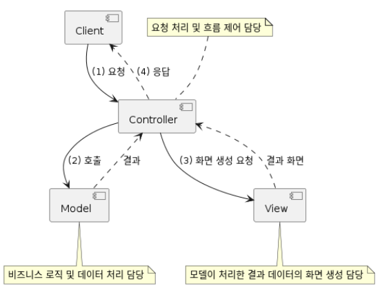
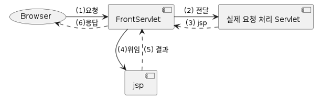

## MVC

유연하고 확장성을 높이기 위해, 유지보수를 위해 MVC 패턴을 사용한다.
MVC 패턴의 구조는 다음과 같다.

- Model : 비즈니스 로직 및 데이터 처리 담당
- View : 모델이 처리한 결과 데이터이 화면 생성 담당
- Controller : 요청 처리 및 흐름 제어 담당

서블릿들에서 중복되는 부분들을 MVC 패턴을 이용하여

공통 처리 부분과 그렇지 않은 부분들을 나눌 수 있다.

### FrontServlet

1. 모든 요청을 FrontServlet이 다 받아서 .do로 구분을 짓는다. 
   Ex.)

   /foods.do : FrontServlet이 처리

   /foods : 실제 요청은 Servlet에서 처리
2. 요청 URL에 따라 실제 요청을 처리할 서블릿으로 요청을 전달한다.
3. 실제 요청을 처리한 서블릿은 처리 결과를 어떤 jsp에서 view 할 건지를 반환한다.
4. 실제 요청을 처리한 서블릿이 전달해 준 jsp로 view 처리를 위임한다.
    - 에러가 발생한 경우는 error page로 지정된 jsp에게 view 처리를 위임한다.
5. JSP는 실제 요청을 처리한 서블릿에서 ServletRequest에 설정한 속성을 이용해 view 처리를 수행한다.
6. FrontServlet이 요청에 대해 응답한다.

FrontServlet을 적용하게 되면 서블릿에서는 공통 로직을 제거할 수 있고,

view 처리를 단순하게 `request.setAttribute("view", "{JSP 경로}")`만 해주면 된다.
또 서블릿과 JSP에서 외부 접근 URL과 Filter 적용 URL도 모두 *.do로 변경하면 된다.

따라서 HttpServletRequest, HttpServletResponse 를 인자로 받아서
view JSP 경로만 전달해 주면 되기 때문에,

각각에 클래스들은
굳이 서블릿일 필요가 없고,
HttpServletRequest, HttpServletResponse 를 인자로 받고

view JSP 경로를 반환하는 하나의 인터페이스를 구현하는 여러 클래스들로 구현이 가능하다.

## Command 패턴

요청을 객체의 형태로 캡슐화하여 요청을 수신하는 객체가 이를 처리할 수 있도록 하는 패턴.
command를 저장하여 메서드에 전달하거나 다른 객체들처럼 반환할 수 있게 해준다.

요청 처리 과정을 캡슐화해서 요청 처리 과정의 변경이나 확장에 유연하게 대응할 수 있다.

기존 서블릿과 구별하기 위해 `-Servlet` 대신 `-Controller`라는 접미사를 사용하고,
Command 인터페이스를 구현한다.

FrontServlet 으로 공통 처리 부분을 모으고

view 처리, 예외 처리, 기타 공통 로직 등을 처리한다.

실제 요청 처리 서블릿은 호출 규칙을 추상화하기 위해 Command 패턴 적용한다.

이렇게 되면 서블릿은 서블릿 인터페이스를 구현하지 않는 일반 클래스가 되고,

HttpServlet에 대한 의존성이 사라져 재사용성을 높일 수 있다.