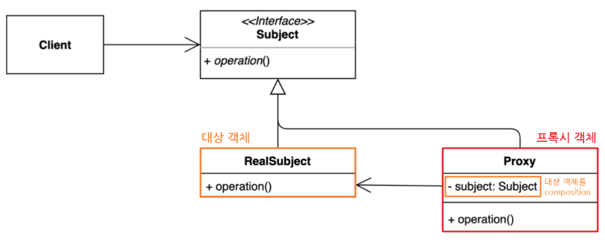
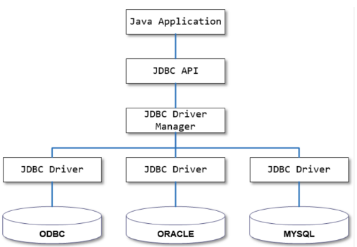
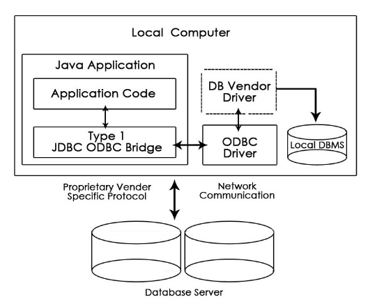
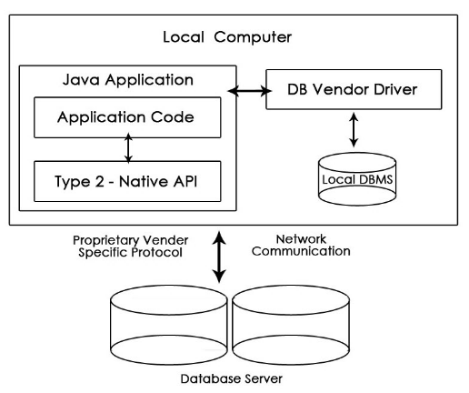
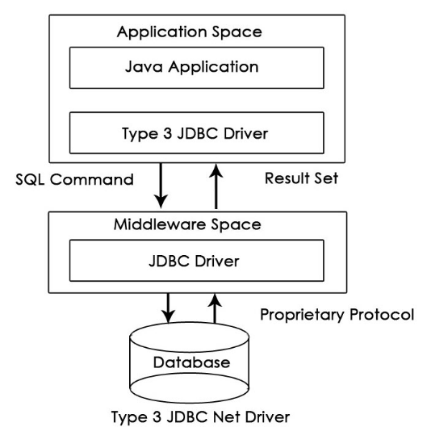
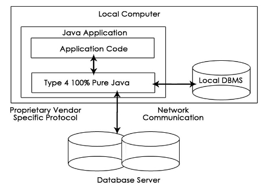
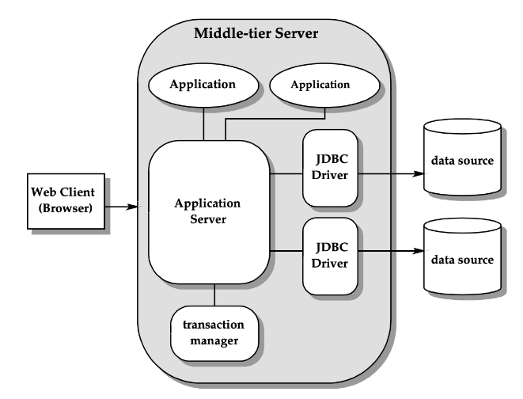
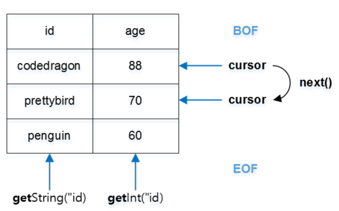

## Reflection
리플렉션은 자바 프로그래밍 언어의 기능이며, 실행중인 자바 프로그램이 자체적으로 검사하거나 

프로그램 내부 속성을 조작할 수 있다.

자체적으로 생성된 객체의 클래스 타입을 알지 못하더라도,

해당 클래스의 메서드, 타입, 변수들에 접근할 수 있도록 해준다.

리플렉션을 통해 자바 프로그램 내에서 클래스를 읽고 변수, 메서드, 생성자를 알아내어 작업할 수 있다.

작성 시점에는 어떠한 클래스를 사용해야할지 모르지만 런타임 시점에서 가져와 실행해야하는 경우 필요하다.

## Annotation
어노테이션은 프로그램을 구성하는 직접적인 코드는 아니지만,

프로그램 작성에 도움을 주거나 필요한 데이터를 제공해주는 역할을 한다.

컴파일러에게 코드 작성 문법 에러를 체크하도록 정보를 제공하고,

Lombok과 같이 개발 툴이 코드를 자동으로 생성할 수 있도록 정보를 제공하고,

런타임 시 특정 기능을 실행하도록 정보를 제공한다.

### 자바 내장 Annotation
`@Override`

재정의된 메소드

상위(부모)에서 해당 메서드를 찾을 수 없다면 컴파일 에러 발생

`@SuppressWarnings`

알고 있는 내용으로 경고 필요 없음 즉 컴파일 경고를 무시하도록 한다.

`@SafeVarargs`

제네릭 타입의 가변인자에 사용한다.
컴파일러가 확인하기 어려운 까다로운 문제

`@FunctionalInterface`

함수형 프로그램을 하기 위해서 인터페이스를 일급함수를 만들기 위해서 사용한다.

`@Native`

native 메소드에서 참조되는 상수 앞에 붙인다.

### Meta Annotation
Java5에 추가된 기능으로 어노테이션을 선언할 때 사용하는 어노테이션이다.

`@Target`

어노테이션이 적용 가능한 대상을 지정하는데 사용한다.
즉 컴파일러가 어노테이션을 어디에 적용할지 결정하는 어노테이션 입니다.

`@Retention`

어노테이션 유지되는 범위를 지정하는데 사용한다.

**범위**

- RetentionPolicy.RUNTIME

  - 컴파일 이후에도 JVM 에 의해서 계속 참조가 가능하다.

    주로 리플렉션이나 로깅에 많이 사용된다.

- RetentionPolicy.CLASS

    컴파일러가 클래스를 참조할 때가지 유효하다.

- RetentionPolicy.SOURCE

    컴파일 전까지만 유효하다.

    즉,   컴파일 이후에는 사라지게 된다.

`@Inherited`

어노테이션이 자손 클래스에 상속되도록 한다.

`@Deprecated`

언제 지원이 중단될지 모르니 사용하지 말 것을 권장하는 어노테이션이다.

`@Repeatable`

어노테이션을 반복해서 적용할 수 있게 한다.

`@Documented`

어노테이션 정보가 Javadoc으로 작성된 문서에 포함되게 한다.

### 프록시 패턴
어떤 객체를 사용하고자 할 때, 객체를 직접적으로 참조하는 것이 아닌

해당 객체를 대항하는 객체를 통해 대상 객체를 접근하는 방식을 사용한다.

대상 클래스가 민감한 정보를 가지고 있거나 인스턴스화 하기에 무겁거나 추가 기능을 가미하고 싶은데, 

원본 객체를 수정할수 없는 상황일 때를 극복하기 위해 사용한다.



## JDBC
JDBC는 관계형 데이터베이스에 저장된 데이터를 접근 및 조작할 수 있게 해주는 Java API이다.
JDBC를 이용하면 다양한 DBMS에 대해 종류에 관계없이 일관된 API로 사용할 수 있게 된다.

### JDBC 구조
JDBC는 API, Driver, Driver Manager로 구성되어 있다.



- JDBC API
  - 자바 응용프로그램에서 DB를 연결하고 제어할 수 있도록 만든 인터페이스와 클래스들
- JDBC Driver Manager
  - 자바 응용프로그램이 사용하는 DB에 맞는 JDBC 드라이버를 찾아서 로드해준다.
- JDBC Driver
  - 각 DB 개발사에서 만든 DB 드라이버

## JDBC Type
JDBC Driver는 4가지 타입을 가지고 있다.
1. JDBC-ODBC Bridge
    
    

  JDBC와 ODBC 사이의 브릿지 역할을 한다. 

  JDBC 호출은 ODBC 호출로 변환한 다음, ODBC 드라이버에게 요청을 보낸다.
   
  마이크로소프트에서 작성한 DBMS 접근 표준으로, 사용하기는 쉽지만 실행시간이 느리다는 단점이 있다.
2. Native API Partly Java Driver

   

  Java Native Interface, JNI를 이용하여 DB 전용 네이티브 클라이언트를 호출한다.
    
  1번에 비해 실행속도가 빠른 편이지만 네이티브 라이브러리를 설치해야 하고 소프트웨어 관리 비용이 증가하게 된다.
    
  DB 제품을 바꾼다면 응용 시스템에 많은 수정이 필요할 수 있다.

3. Network Protocol Driver 
   
    
  
  JDBC 미들웨어 서버와 독점 프로토콜로 통신한다.
   
  JDBC 미들웨어는 요청한 프로토콜을 DB 호출로 변환하여 사용하고,
    
  이 드라이버와 미들웨어는 DB 제품을 바꾸더라도 영향을 받지 않는다는 특징이 있다.

  많은 네트워크 호출을 하므로 상대적으로 느린 편이다.
4. Thin Driver

   

  현재 가장 많이 쓰이는 형태로, 직접 DB와 통신하기 때문에 순수 자바 드라이버로도 불린다.

  네이티브 라이브러리 및 미들웨어 서버가 전혀 필요 없고, 다른 드라이버에 비해 가장 좋은 성능을 가지고 있다.
  

### JDBC API
JDBC API는 서버 애플리케이션에 데이터베이스 호출을 포함할 수 있는 Java 클래스 및 메소드 세트이다.

JDBC API를 사용하면 관계형 DB부터 스프레드시트, 플랫 파일까지 거의 모든 데이터 소스에 액세스 할 수 있다.

## JDBC 구조
### Two-Tier Architecture
Two-Tier 아키텍처는 Client Layer와 Server Layer로 구성된다.

Java 응용 프로그램과 데이터베이스가 직접 통신하는 방식으로,

JDBC 드라이버를 통해 쿼리 또는 요청은 사용자가 DB로 전송하고 결과는 사용자에 의해 다시 수신된다.

클라이언트 프로그램이 바로 DB에 접속하는 구성이라 확장성에 제한이 있다.

### Three-Tire Architecture




비즈니스 로직을 담은 미들웨어가 추가된다. 우리의 경우 Tomcat을 사용한다.

사용자 PC에서 DB로의 직접적인 통신은 없고, 미들웨어를 거쳐 전송한다.

성능을 높이고 응용 프로그램 배포를 단순화할 수 있다.

### JDBC Drvier
JDBC 드라이버를 로딩하기 위하여 `Class.forName(java Reflection)` 을 사용한다.

Driver 로드는 전체 프로젝트에서 한 번만 실행되어야 한다.

DriverManager를 통해 자바 응용프로그램을 JDBC 드라이버에 연결시켜 줄 수 있다.

`getConnection()` 메서드로 Connection을 가져올 수 있다.

`Connection connection = DriverManager.getConnection(URL, user, password);`

### Connection close
커넥션 객체를 더 이상 사용하지 않을 때 `Connection.close()` 메서드를 호출한다.

close()를 하지 않으면 메모리 누수가 발생해 시스템 장애가 발생하기 때문에 꼭 해줘야 한다.

### SQL Exeption
JDBC에서 쿼리를 실행하거나 생성할 때 예외가 발생할 수 있다.

DB 또는 드라이버로 인해 발생하는 예외는 SQL 예외에 속하고,

일반적인 예외를 처리하는 것처럼 `SQLException`을 통해 SQL 예외를 처리할 수 있다.

### Statement
Java에서 SQL 문을 실행하기 위해서는 Statement 클래스를 이용하고,

SQL문 실행 결과를 얻어오기 위해서는 ResultSet 클래스를 이용한다.

```java
Statement statement = connection.createStatement();
ResultSet resultSet = statement.executeUpdate("select * from jdbc_students where id='marco'");
```

### Statement의 메서드
- executeQuery()
SELECT 쿼리를 실행할 때 사용한다.

ResultSet 결과를 반환한다.

- executeUpdate()

INSERT 등의 DDL을 실행하기 위해서 사용합니다.

int 타입으로 성공 여부나 처리된 데이터 수를 반환합니다.

### ResultSet


ResultSet 객체는 현재 데이터의 행을 가리키는 커서를 관리한다.

초기 값은 첫번째 행 이전, BOF(Beginning Of File)을 가리키도록 되어있다.

