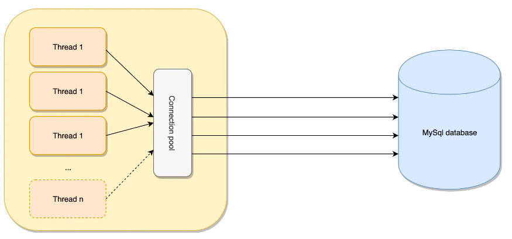

## PreparedStatement

DBMS에서 동일하거나 비슷한 쿼리문을 높은 효율성으로 반복하기 위해 사용되는 기능이다.

미리 준비된 SQL을 보내고 싶다면 `PreparedStatement` 를 사용할 수 있다.

DB에서 cache를 조회하여 이전에 컴파일된 쿼리를 사용해 `SQL Injection`을 방어할 수 있다.

**SQL Injection**
> 보안상의 취약점을 이용하여 임의의 SQL 문을 주입하고 실행되게 하여 <br>
> DB가 비정상적인 동작을 하도록 조작하는 행위.

## Connection Pool



DB에 접근하기 위한 패턴이다.

미리 Connection 객체를 생성하여 Pool 또는 Container(tomcat)에 배치한다.

어플리케이션에서 Connection 객체가 필요할 때, 새로운 객체를 생성하는 대신 Pool에서 해당 객체를 가져와

사용하고 재사용을 위해서 사용된 객체는 Pool에 반납한다.

이렇게 하면 얻을 수 있는 장점은 다음과 같다.

- DB에 Connection을 생성할 때 소요되는 시간 및 자원을 줄일 수 있다.
- Connection 수를 제한할 수 있어 과다한 접속으로 인한 서버 자원 고갈을 예방할 수 있다.
- 메모리 영역에서 Connection을 관리하기 때문에 클라이언트가 DB 작업을 빠르게 진행할 수 있다.

### Connection Pool 구현

1. DataBase Driver를 사용하여 DataBase 연결

2. 데이터 읽기/쓰기 위한 TCP/Socket Open

3. Socket을 통해서 데이터 읽기/쓰기

4. DataBase 연결 닫기

5. TCP/Socket Close

### Apache Commons DBCP(DataBase Connection Pool)

Apache에서 만든 DataBase Connection Pool이다.

사용 파라미터는 다음과 같다.

| Parameter             | Default      | Description                                                                                                          |
|-----------------------|--------------|----------------------------------------------------------------------------------------------------------------------|
| initialSize           | 0            | 최초 connection pool 시작될 때 초기 Connection 개수                                                                            |
| maxTotal              | 8            | 최대로 사용할 수 있는 Connection 개수                                                                                           |
| maxIdle               | 8            | Connection pool에 반납할 때 최대 유지될 수 있는 Connection 수                                                                      |
| minIdle               | 0            | 최소한으로 유지될 Connection 수                                                                                               |
| maxWaitMillis         | indefinitely | 풀이 예외를 발생시키기 전에 연결이 반환될 때까지 대기하는 시간(밀리초 단위)                                                                          |
| validationQuery       |              | Connection pool에 Connection을 반환하기 전에 해당 풀의 연결여부를 확인<br>- `mysql` : `select 1` <br> - `oracle` : `select 1 from dual` |
| testOnBorrow          | true         | pool에서 Connection을 사용하기 위해서(Connction pool에서 Connection 얻어올 때) 유효성 검사 여부                                             |
| testOnReturn          | false        | Connection을 pool에 반환할 때 유효성 검사 여부                                                                                    |
| maxConnLifetimeMillis | -1           | 커넥션의 최대 라이프타임을 지정                                                                                                    |
| lifo                  | true         | 최근에 반환한 Connection을 가장 우선 대여해 줍니다.                                                                                   |

### PoolableConnection
`connection.close()` 대신 `PoolableConnection.close()` 를 사용하면 

connection을 close 하는 대신 자기 자신을 커넥션 풀에 반환한다.

그렇게 되면 풀에 반환한 후 나중에 연결이 필요할 때 다시 사용할 수 있어 성능을 향상 시킬 수 있다.

**최적화**

Tomcat은 Thread pool을 사용해 동시에 최대 200개까지의 요청을 처리할 수 있는 것을 기본 설정으로 사용중이다.

따라서, DBCP의 파라미터를 WAS의 스레드 풀 사이즈로 고정해서 최적화를 시킬 수 있다.

톰캣의 최대 처리량보다 많은 DB 커넥션이 생성되면 일부 커넥션은 대기하고 있게 되므로 적절하게 조정하는 것이 중요하다.

## JNDI
JNDI는 다른 종류의 이름 지정 및 디렉토리 서비스에 액세스하는데 필요한 API이다.

일반적으로 자바 애플리케이션을 외부 디렉터리 서비스에 연결할 때 사용한다.

우리가 연결하고 싶은 데이터베이스의 DB Pool을 미리 네이밍시켜주는 방법 중 하나이다. 

우리가 저장해놓은 WAS 의 데이터베이스 정보에 JNDI를 설정해 놓으면 웹 애플리케이션은 JNDI만 호출하면 간단해진다.

Web Application 서버에 설정된 데이터 소스를 `InitialContext.lookup()` 메서드로 가져올 수 있다.
```java
InitialContext initialContext = new InitialContext();
DataSource dataSource = (DataSource)initialContext.lookup("java:comp/env/jdbc/test");
```

`WEB-INF` 안에 `context.xml` 파일을 만들어 DataSource를 등록해준다.

## 트랜잭션
트랜잭션은 DB의 상태를 변환시키는

**하나의 논리적 기능을 수행하기 위한 작업의 단위** 

또는 **한꺼번에 모두 수행되어야 할 일련의 연산** 들을 의미한다.

### 트랜잭션 속성

트랜잭션은 데이터의 무결성을 유지시키기 위해 다음의 4가지 성질을 가지고 있다.

- Atomicity (원자성)

    - 트랜잭션의 수행결과는 DB에 전부 반영되거나, 전부 반영되지 않아야 한다.<br>(All or Nothing)
    
    - 트랜잭션 작업 중 문제가 발생하면 전체 작업을 취소(ROLLBACK) 시키는 과정을 거쳐야 한다.
- Consistency (일관성)
  - 트랜잭션을 수행한 후 데이터 모델의 모든 제약조건을 만족해야 한다.
  - 기본 키와 외래 키, 속성에 대한 제약 조건과 같은 명시적인 무결성 제약 조건을 모두 만족해야 한다.
- Isolation (고립성)
    - 트랜잭션 수행 시 다른 트랜잭션이 영향을 미치지 않아야 한다.
- Durability (영속성)
  - 트랜잭션의 성공 결과는 장애 발생 후에도 변함없이 보관되어야 한다.
  - 작업을 성공한 후에는 DB에 확실히 기록하여야 하며, 부분적으로 수행한 경우 롤백해야 한다.
  - 정상적으로 완료된 부분을 DBMS가 책임지고 DB에 기록하는 성질을 트랜잭션의 **영속성**이라고 한다.

### JDBC에서의 트랜잭션
- `commit()`
  - 트랜잭션의 커밋을 수행한다.
    - `setAutoCommit(boolean autoCommit)` : 자동으로 커밋할지를 설정한다. 기본값은 true
- `rollback()`
  - 트랜잭션의 롤백을 수행한다.

트랜잭션 처리를 위해 `setAutoCommit(false)` 로 설정하면 수동적으로 커밋할 수 있다.