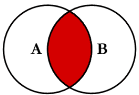
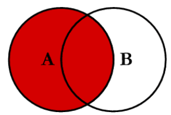
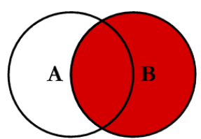
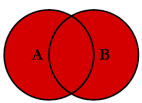
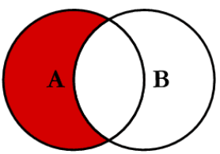
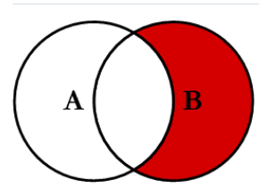
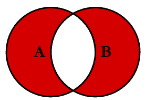
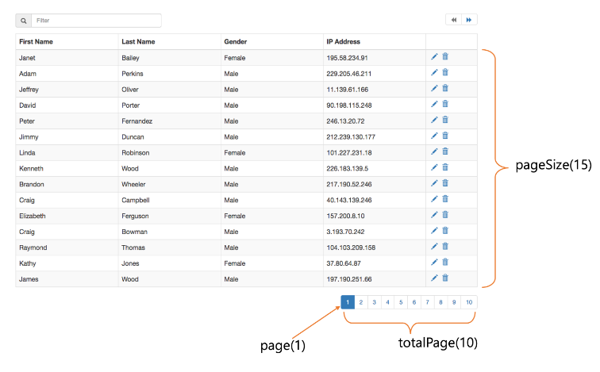

## Isolation Level

동시에 여러 트랜잭션이 처리될 때 특정 트랜잭션이 다른 트랜잭션에서 변경하거나 조회하는 데이터를

볼 수 있도록 허용할 지 말지를 결정하는 것.

### 트랜잭션 격리 수준에 따라 발생할 수 있는 문제점

- Dirty Read
    - 트랜잭션 작업이 완료되지 않았는데도 다른 트랜잭션에서 볼 수 있게 되는 현상
- Non-Repeatable Read
    - 같은 트랜잭션 내에서 같은 데이터를 여러 번 조회했을 때 읽어온 데이터가 다른 경우
- Phantom Read
    - 다른 트랜잭션에서 수행한 변경 작업에 의해 레코드가 보였다가 안 보였다가 하는 현상

### READ UNCOMMITTED

가장 낮은 격리수준으로,

각 트랜잭션에서의 변경 내용이 COMMIT 이나 ROLLBACK 여부에 상관없이 다른 트랜잭션에서 값을 읽을 수 있다.

정합성에 문제가 많은 격리 수준이기 때문에 보통 사용하지 않는다.

Commit 이 되지 않는 상태이지만 update 된 값을 다른 트랜잭션에서 읽을 수 있기 때문에 Dirty Read 현상이 발생할 수 있다.

### READ COMMITTED

커밋이 완료된 데이터만 다른 트랜잭션에서 조회가 가능하다.

트랜잭션이 이루어지는 동안 접근한 행을 다른 트랜잭션이 수정할 수 있다.

### REPEATABLE READ

트랜잭션마다 트랜잭션 ID를 부여해서 트랜잭션 ID 보다 더 낮은 트랜잭션 번호에서 변경한 것만 읽게 한다.

Undo 공간에 백업해 두고 실제 레코드 값을 변경하는 방식을 사용하고,

이러한 방식을 MVCC(Multi Version Concurrency Control)라고 부른다.

### SERIALIZABLE

가장 단순하지만 가장 엄격한 격리 수준이다.

트랜잭션을 순차적으로 진행시켜 여러 트랜잭션이 동일한 레코드에 동시 접근할 수 없도록 한다.

성능 측면에서는 동시 처리성능이 가장 낮지만, 데이터 정합성은 가장 뛰어나다.

성능이 낮아 실무에서는 거의 사용되지 않는다.

### JDBC에서의 격리 레벨 설정 방법

java.sql.Connection 을 보면 다음과 같이 정의가 되어있다.

```java
int TRANSACTION_NONE = 0; // transaction 지원 안 함
int TRANSACTION_READ_UNCOMMITTED = 1;
int TRANSACTION_READ_COMMITTED = 2;
int TRANSACTION_REPEATABLE_READ = 4;
```

Isolation Level을 변경하는 방법은

`connection.setTransactionIsolation(Connection.TRANSACTION_~~);`

으로 구현하면 된다.

MySQL, InnoDB 엔진에서는 Default Level로 **REPEATABLE READ** 를 사용한다.

## Join

두 개 이상의 테이블 사이의 공통 필드를 기반으로 데이터 또는 행을 결합하는 데 사용한다.

### Inner Join
공통적인 부분만 SELECT 하는 방식으로 여러 어플리케이션에서 사용되는 방식이다.

A ∩ B 교집합



```sql
select *
from TableA a
         INNER JOIN TableB b
                    on a.key = b.key
```

### Left Join
공통적인 부분 + LEFT 테이블에 있는 데이터만 SELECT 해서 가져온다.

A ∩ B 교집합



```sql
select *
from TableA a
         LEFT JOIN TableB b
                   on a.key = b.key
```

### Right Join
공통적인 부분 + RIGHT 테이블에 있는 데이터만 SELECT 해서 가져온다.

B ㅡ A 차집합



```sql
select *
from TableA a
         RIGHT JOIN TableB b
                    on a.key = b.key
```

### Full Join

A ∪ B 합집합



```sql
select *
from TableA a FULL JOIN TableB b
on a.key = b.key
```

MySQL에서는 FULL JOIN을 지원하지 않고,

left join union right join으로 사용하면 된다.

```sql
select *
from TableA a
         LEFT JOIN TableB b
                   on a.key = b.key
union

select *
from TableA a
         RIGHT JOIN TableB b
                    on a.key = b.key
```

### Left Excluding Join



```sql
select *
from TableA a
         LEFT JOIN TableB b
                   on a.key = b.key
where b.key is null
```

### Right Excluding Join



```sql
select *
from TableA a
         RIGHT JOIN TableB b
                    on a.key = b.key
where a.key is null
```

### Outer Excluding Join



```sql
select *
from TableA a FULL OUTHER JOIN TableB b
on a.key = b.key
where a.key is null or b.key is null
```

마찬가지로 MySQL은 Full Other Join을 지원하지 않아서,

Left Excluding Join + Union + Right Excluding Join 으로 구현한다.

```sql
select *
from TableA a
         LEFT JOIN TableB b
                   on a.key = b.key
where b.key is null

union

select *
from TableA a
         RIGHT JOIN TableB b
                    on a.key = b.key
where a.key is null
```

## Pagination
제공할 데이터는 많으나 한 번에 보여줄 수 없을 때 사용하는 기능이다.



### Pagination 기능

- totalPage

  전체 페이지(수) = 올림 ( 전제 로우(수) / pageSize )

    예)
    totalCount = 101<br>
    pageSize=10<br>
    [올림] 101 / 10<br>
    totalPages = 11

    `totalPages = (totalCount==0)?1:(int)Math.ceil((double)totalCount/(double)pageSize);`

- LIMIT
  
  select문에는 LIMIT 옵션이 있는데, 이거로 결과 집합의 행 수를 제한할 수 있다.
  
  `[LIMIT {[offset,] row_count | row_count OFFSET offset}]`

  여기서 offset은 첫 번쨰 행의 위치를 의미하고, limit은 offset으로부터 반환할 행의 수를 의미한다..

  - offset은 0부터 시작한다.
    - `SELECT * FROM tbl LIMIT 5,10;  # Retrieve rows 6-15`
    - 이 쿼리를 실행하면 6-15행이 나오게 된다.
  - n번째 행부터 마지막 행까지 반환한다.
    - `SELECT * FROM tbl LIMIT 95,18446744073709551615;`
    - 이 쿼리를 실행하면 96번째 행부터 마지막 행까지 반환한다.
    
  - 처음부터 n번째 까지 반환한다.
    - `SELECT * FROM tbl LIMIT 5;`
    - 이 쿼리를 실행하면 0-4행까지 반환한다.

총 행 수가 101개고, pageSize는 10, totalPages는 11로 설정해뒀다고 하면
```sql
select * from table limit 0,10
select * from table limit 1,10
select * from table limit 2,10
select * from table limit 3,10
select * from table limit 4,10
select * from table limit 5,10
select * from table limit 6,10
select * from table limit 7,10
select * from table limit 8,10
select * from table limit 9,10
select * from table limit 10,10
```
으로 모든 페이지를 가져올 수 있다.