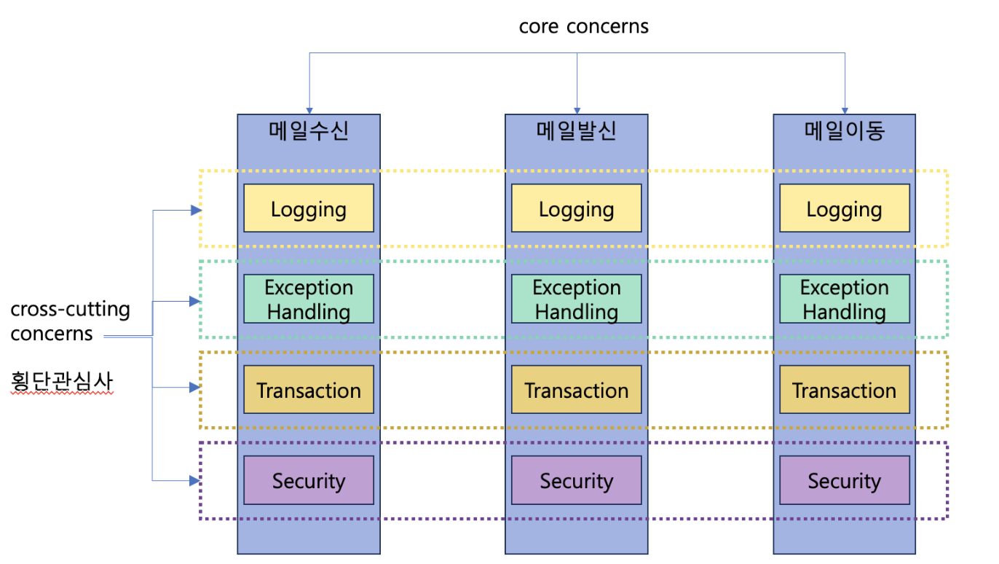
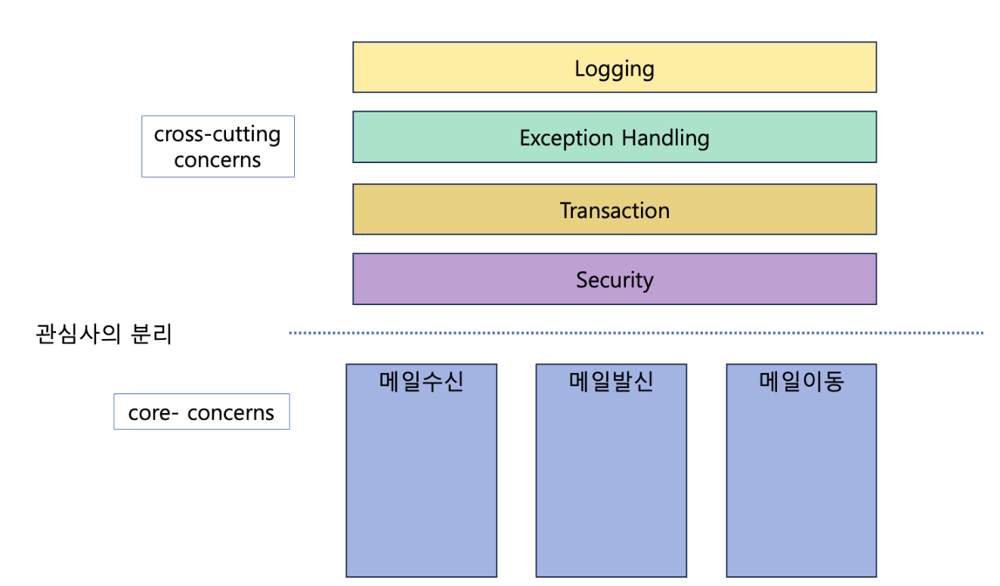

## @Bean

@Bean 어노테이션에 빈의 생성, 소멸의 콜백 메서드를 지정할 수 있다.
xml 설정의 init-method, destroy-method 속성과 동일한 기능을 제공한다.

xml 설정에서 했던 것처럼 생성과 소멸 콜백, 스코프 등을 다 지정할 수 있다.

## 컴포넌트 스캔

스프링 빈이 수십, 수백개가 되면 일일이 등록하기도 귀찮고,

설정 정보도 커지고, 누락하는 문제도 발생하기 때문에,

컴포넌트 스캔을 이용해서 설정 정보가 없어도 자동으로 스프링 빈을 등록해준다.

의존관계는 @Autowired를 이용해서 주입한다.

- @Bean은 메서드 레벨에서 선언
- @Component는 클래스 레벨에서 선언

### Bean Scanning 의 대상이 되는 어노테이션들

@Configuration

@Component - 기본 스프링 관리 컴포넌트

@Controller - Spring Web Mvc 에서 Controller

@Service - Service layer 의 컴포넌트 마커

@Repository - Data Access Object를 의미하는 marker 어노테이션 (Exception Translation 기능 제공)

## AOP

Aspect Orientation Programming, 관점 지향 프로그래밍을 의미한다.

스탑워치로 시간 로그를 찍는 것과 같이 핵심 비즈니스 관심사에 해당하지 않는 반복되는 코드가 들어가게 될때,

관심사를 횡단 관심사로, 횡적으로 생각해서 구현해보는 것을 뜻한다.



- crosscutting concerns: 횡단 관심사

- core concerns : 주요 관심사

횡단 관심사와 주요 관심사를 나누어 관점별로 각 기능을 모듈화하는 것이다.



### AOP 주요 용어

- Aspect
    - 여러 클래스에 걸친 횡단 관심사의 모듈
    - 하나 이상의 Pointcut과 Advice의 조합으로 만들어지는 기본 모듈
    - @Aspect를 통해 사용 가능하다.

- Join Point
    - 프로그램 실행 중의 어떤 포인트를 의미한다. (메서드 실행, Exception 처리 등)
    - Pointcut의 후보이고, Spring AOP 에서는 메서드 실행만 JoinPoint이다.

- Advice
    - 메서드 실행할 때 취하는 행동을 정의한 것.
    - 특정 Join Point에서 Aspect가 취하는 행동이다.
        - ex) around, before, after

- Pointcut
    - Advice를 적용할 Join point를 선별하는 작업 또는 그 기능을 적용한 모듈
    - execution 과 within으로 지정자를 정해준다.
    - execution은 메서드 실행 조인포인트와 매칭해주고, within은 주어진 타입으로 조인포인트와 매칭해준다
    - 주로 execution을 사용한다.

### AOP 예제

@EnableAspectJAutoProxy 을 @Configuration이 있는 클래스에 달아줘서 AOP를 선언해주고,

AOP를 사용하는 클래스에 @Aspect를 달아준다.

```java

@Aspect
@Component
public class ElapsedTimeAspect {
    //    @Pointcut("within(com.nhnacademy.edu.springframework.messageSender.MessageSendService)")
    @Pointcut("execution(void com.nhnacademy.edu.springframework.messageSender.MessageSendService.doSendMessage(..))")
    public void messagePointCut() {
    }

    @Around("messagePointCut()")
    public Object timeCheck(ProceedingJoinPoint pjp) throws Throwable {
        StopWatch stopWatch = new StopWatch("Logging Tracker");
        try {
            stopWatch.start();

            Object retVal = pjp.proceed();

            return retVal;
        } finally {
            stopWatch.stop();
            System.out.println(stopWatch.prettyPrint());
        }
    }
}
```
