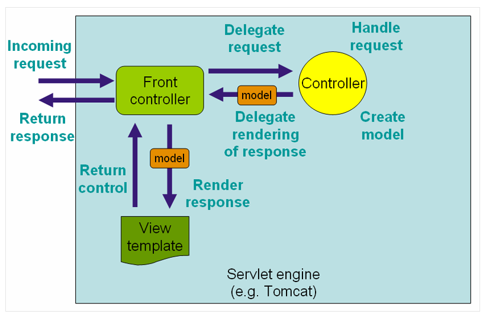

## Spring MVC
Spring Framework이 직접 제공하는 Servlet API 기반의 웹 프레임워크

### WebApplicationContext

Root ApplicationContext와 ServletApplicatonContext로 나뉜다.

1. RootApplicationContext
   - 최상단에 위치한 Context 이다.
   - 웹 환경에 독립적인 빈들을 담아둔다. 서로 다른 서블릿 컨텍스트에서 공유해야 하는 빈들을 등록해놓고 사용할 수 있다.
      Servlet context에 등록된 빈들을 이용 불가능하고, servlet context와 공통된 빈이 있다면 servlet context 빈이 우선된다.
      WebApplication 전체에 사용가능한 DB연결, 로깅 기능들이 이용된다.

2. WebApplicationContext 
   - 서블릿에서만 이용되는 Context이다
      DispatcherServlet이 직접 사용하는 컨트롤러를 포함한 웹 관련 빈을 등록하는 데 사용한다.
   
      DispatcherServlet은 WebApplicationContext를 가지고 있고, 
      모두 동일한 Root WebApplicationContext를 공유한다.

`@EnableWebMvc` 를 이용해서 기본 설정이 가능하고, 추가적인 구현이 필요하다면 

`WebMvcConfigurer` 인터페이스를 구현해서 만들면 된다.

이전에 배운 FrontController 역할을 `DispatcherServlet`이  해준다.


스프링 부트에서는 `WebMvcAutoConfiguration`에서 설정을 자동으로 해준다.

### SpringServletContainerInitializer
스프링에서는 `SpringServletContainerInitializer`를 통해 서블릿들을 찾아 컨테이너에 넣어준다.
@HandleTypes에 정의된 클래스 혹은 구체적으로 구현 된 하위 클래스들이 객체가 생성되어 컨테이너에 들어가게 된다.

### MVC


이전에 배운 FrontController 역할을 `DispatcherServlet`이 해주게 되고,
model은 스프링 빈, View는 JSP가 해주게 된다

Controller는 `@Controller`를 이용해서 구현하고, 

Front Controller 패턴에서 Command interface 구현 클래스에 해당한다.

`@Controller`는 stereotype bean 중 하나이고, 컴포넌트 스캔을 통해서 자동으로 빈 등록이 된다.

Controller에서는 ModelAndView를 반환해서 컨트롤러에서는 Servlet과 관련 없이 코드를 작성할 수 있게 해준다.

### HTTP Method
@RequestMapping에 url과 메서드를 입력해서 http method를 매핑해줄 수 있고,
이들은 줄여서 `@GetMapping`, `@PostMapping` 등으로 처리가 가능하다.

또 `@PathVariable`과 `@RequestParam`을 이용해서 값을 가져올 수 있다.

```java
@GetMapping("/persons/{personId}")
public List<Person> getPersons(@PathVariable(name="personId", required=true) Long personId) {
    // ...
}
```

쿠키 값도 마찬가지로 `@CookieValue`를 이용해서 받아올 수 있다.

## URL Pattern
Spring MVC에서는 URL 패턴으로 Ant Style Pattern을 지원한다.

- '?' : 1글자 매칭

- '*' : 0글자 이상 매칭

- '**' : 0글자 이상 하위 경로 매칭

### @ModelAttribute


## 예외처리
예외 처리 메서드에 `@ExceptionHandler` 어노테이션을 달아 예외가 발생했을 때 처리할 로직을 구현할 수 있다.

### 컨트롤러 기반 예외 처리
`@ExceptionHandler` + `@ResponseStatus`
```java
@ExceptionHandler(UserNotFoundException.class)
@ResponseStatus(HttpStatus.NOT_FOUND)
public void notFound() {
    // nothing to do
}
```

`@ExceptionHandler` + View
```java
@ExceptionHandler(UserNotFoundException.class)
@ResponseStatus(HttpStatus.NOT_FOUND)
public String notFound(UserNotFoundException ex, Model model) {
    
    model.addAttribute("exception", ex);
    return "error";
}
```

`@ExceptionHandler + @ResponseBody + HttpMessageConverter`
```java
@ExceptionHandler(Exception.class)
@ResponseBody
public ErrorDto handleException(Exception ex) {
    // ...
    // 예외를 처리하고 에러 메세지를 담은 `ErrorDto` 객체를 생성해서 반환
    return errorDto;
}
```

또한 `@ControllerAdvice`를 이용해서
전역으로 예외를 처리할 수 있다.
