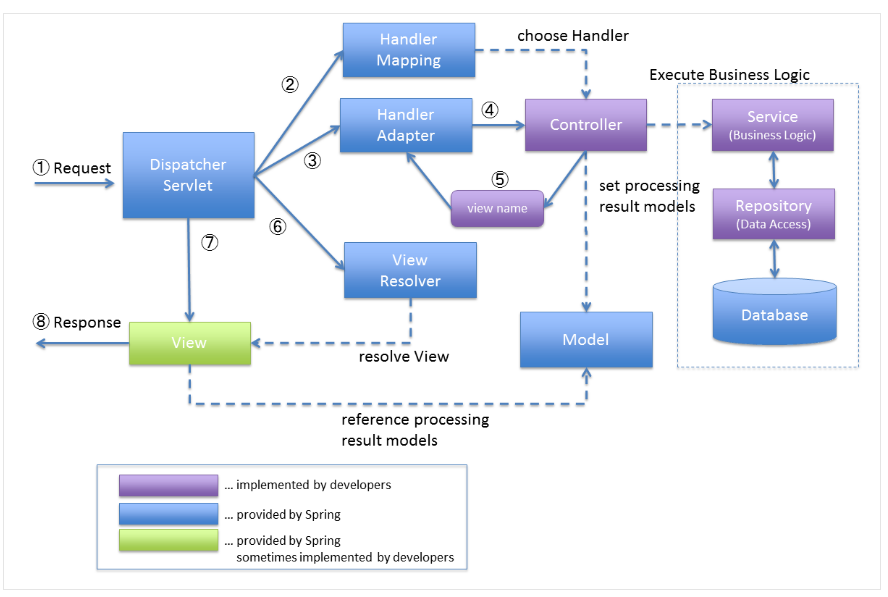

## HttpMessageConverter

파라미터로 요청받거나 객체를 응답할 때, 스프링에서는 `HttpMessageConverter`가

해당하는 타입으로 변환을 해준다.

`@RequestParam`, `@ModelAttribute` 등 우리가 사용하는 어노테이션들을

핸들러 어댑터에서 어떤 타입인지를 찾아 컨버팅해주어 컨트롤러에서 사용할 수 있게 바꿔준다.

### @RestController

@RestController는 @Controller와 @ResponseBody를 합친 것으로, API 응답을 할 것이라는 걸 클래스 단계에서 선언할 수 있다.

### @ResponseEntity

`@ResponseBody`에 http Status와 응답 헤더 등을 설정할 수 있는 어노테이션이다.

```java

@GetMapping("/something")
public ResponseEntity<String> handle() {
    String body = ...;
    String etag = ...;
    return ResponseEntity.ok()          // http status (200 OK)
            .eTag(etag)    // response header (ETAG)
            .build(body);  // response body
}
```

## Spring MVC 구조


Handler == Controller, 핸들러는 컨트롤러라고 생각해도 무방하다.

- HandlerMapping
  서버로 들어온 요청을 어느 핸들러로 전달할 지 결정하는 역할

- HandlerAdapter
  DispatcherServlet과 실제 핸들러 구현 사이를 이어주는 Object Adapter 역할

- ViewResolver
  문자열 기반의 view 이름을 토대로 실제 View 구현을 결정하는 역할

### HandlerInterceptor
Servlet Filter와 유사하게

DispatcherServlet이 Controller를 호출하기 전/후에

요청 및 응답을 참조, 가공할 수 있는 일종의 필터 역할을 한다.

필터는 DispatcherServlet이 호출되기 전/후에만 동작하지만,

HandlerInterceptor는 DispatcherServlet이 실행된 이후에 Controller 실행 전/후에 동작한다.

또한 HandlerInterceptor는 Servlet ApplicationContext에 등록/관리되어 사용된다.