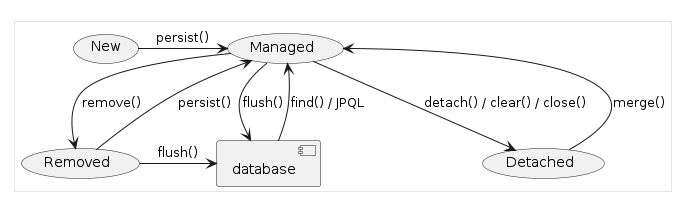

### JPA

### JPA를 사용해야 하는 이유

우리는 자바 기반의 프로젝트를 만들기 때문에, SQL 중심이 아닌 객체 중심으로 개발을 해야 한다.

SQL 중심으로 개발을 하게 되면 변경의 폭이 좁아지고, 수정이 번거로워진다.

JPA는 객체와 관계형 DB 사이의 패러다임의 불일치로 발생하는 문제 (상속, 연관관계 등) 를 해결해준다.

또 JPA를 사용하면 반복적인 CRUD용 SQL을 개발자가 직접 작성하지 않아도 된다.

추후 Spring Data JPA를 사용하면, 인터페이스 선언만으로도 쿼리 구현이 가능하게 된다.

이 때 JPA가 관리하는 모델로 만들어줘야 하는데, 이를 엔티티(Entity)라고 한다.

## Spring 과 JPA

### Spring Data

- 다양한 데이터 저장소에 대한 접근을 추상화하기 위한 스프링 프로젝트이다.
- JPA, JDBC, Redis, ElasticSearch 등

### Spring Data JPA

- 레포지토리 추상화를 통해 인터페이스 선언만으로도 구현이 가능하다.
- 메서드 이름으로 쿼리를 생성해준다.
- 페이징, 정렬, 도메인 클래스 컨버터 기능 등을 제공해준다.

## 트랜잭션

트랜잭션은 DB의 상태를 변환시키는 하나의 논리적 기능을 수행하기 위한 작업의 단위.

또는 한꺼번에 모두 수행되어야 할 일련의 연산들을 의미한다.

### 트랜잭션의 속성

- Atomicity(원자성)

    - 트랜잭션의 수행결과는 DB에 전부 반영되거나, 전부 반영되지 않아야 한다. (All or Nothing)

    - 트랜잭션 작업 중 문제가 생기면 전체 작업을 취소(ROLLBACK)하는 과정을 거쳐야 한다.
- Consistency(일관성)
    - 트랜잭션 수행 후 데이터 모델의 모든 제약조건을 만족해야 한다.
    - 잔고의 데이터 타입이 정수형이어야 한다 등 기본 키와 외래 키, 속성에 대한 제약조건과 같은
      무결성 제약 조건을 만족시켜야 한다.

- Isolation(고립성)
    - 각각의 트랜잭션은 다른 트랜잭션에 영향을 미치면 안 된다.

- Durability(지속성, 영속성)
    - 트랜잭션의 성공결과는 장애 발생 후에도 변함없이 보관되어야 한다.

### @Transactional

스프링에서는 트랜잭션을 선언해주기 위해 `@Transactional` 어노테이션을 달아준다.

AOP 선언 조건

- 스프링 빈으로 등록이 되어 있어야 한다.
- 해당 메서드가 public이어야 한다.

테스트에서 `@Transactional`을 사용하면 테스트 결과마다 DB에 저장되지 않고, 롤백을 해준다.

### 엔티티 매핑

`@Entity` : JPA가 관리할 객체임을 명시

`@Table` : 맵핑할 DB 테이블 명 지정

`@Id` : 기본 키(PK) 맵핑

`@Column` : 필드와 컬럼 맵핑 (생략 가능)

이러한 어노테이션을 이용해서 DB와 매핑을 해주고, 특정 필드를 매핑하지 않을 경우에는

`@Transient`를 이용한다.

### 기본 키 매핑 전략

객체와 테이블을 매핑할 때 기본 키를 어떻게 할당해줄지를 설정할 수 있다.

- SEQUENCE 전략: 데이터베이스 시퀀스를 사용해서 기본 키를 할당

ex.) Oracle

- IDENTITY 전략: 기본 키 생성을 데이터베이스에 위임

ex.) MySQL

- 직접 할당
    - DB에 의존하지 않고 어플리케이션에서 직접 식별자 값을 할당해주는 방식이다.

### 복합 Key

- `@IdClass`
    - ID를 구분지을 수 있는 클래스를 만든 뒤 엔티티 클래스 레벨에서 어노테이션을 달아준다.
      ```java
      
      @Entity
      @Table(name = "OrderItems")
      @IdClass(OrderItem.Pk.class)
      public class OrderItem {
          @Id
          @Column(name = "order_id")
          private Long orderId;
      
          @Id
          @Column(name = "line_number")
          private Integer lineNumber;
      
          // ...
      
      }
      
      @NoArgsConstructor
      @AllArgsConstructor
      @EqualsAndHashCode
      public static class Pk implements Serializable {
          private Long orderId;
      
          private Integer lineNumber;
      
      }
        ```
- `@EmbeddedId` / `@Embeddable`
    - @EmbeddedId - Entity 클래스의 필드에 지정
    - @Embeddable - 복합 Key 식별자 클래스에 지정
        ```java
      @Entity
      @Table(name = "OrderItems")
      public class OrderItem {
      @EmbeddedId
      private Pk pk;

      // ...

      }
      
      @NoArgsConstructor
      @AllArgsConstructor
      @EqualsAndHashCode
      @Embeddable
      public static class Pk implements Serializable {
      @Column(name = "order_id")
      private Long orderId;
    
          @Column(name = "line_number")
          private Integer lineNumber;
    
      }

    ```

### PK 제약조건

- PK 클래스는 public 으로 선언해야 하고, public한 no-args 생성자를 만들어줘야 한다.
- PK는 반드시 serializable 할 수 있어야 한다.
- PK는 equals와 hashcode 메서드가 정의되어 있어야 한다.

### EntityManagerFactory

`EntityManagerFactory`에서 `EntityManager`를 생성해준다.

일반적으로 DB를 하나만 사용하는 어플리케이션은

보통 만드는 비용이 매우 크기 때문에 `EntityManagerFactory`를 하나만 만들어서 전체에서 공유한다.

### EntityManager

EntityManger는 엔티티의 저장, 수정, 삭제, 조회 등 Entity와 관련된 모든 일을 처리하는 관리자

EntityManager는 thread safe 하지 않기 때문에 여러 thread 간에 절대 공유하면 안 된다.

EntityManager의 생명 주기는 Transactional의 생명 주기와 일치하다.

별도의 요청마다 별도의 EntityManager를 생성해서 사용한다.

## 영속성 컨텍스트

- Entity를 영구 저장하는 환경이다.

### 엔티티의 생명 주기



- 비영속 (new/transient)

  영속성 컨텍스트와 전혀 관계 없는 상태. `new` 로 객체만 생성한 상태를 의미한다.

- 영속 (managed)

  영속성 컨텍스트에 저장된 상태. entityManager에 `persist()`로 선언해주면 된다.

- 준영속 (detached)

  영속성 컨텍스트에 저장되었다가 분리된 상태

- 삭제 (removed)

  삭제된 상태

### 영속성 컨텍스트를 사용하면 얻을 수 있는 장점

- 1차 캐시
    - 같은 객체를 여러 번 find() 요청을 할 때, 영속성 컨텍스트에 저장되어있는 객체를 가져다주기 때문에
      쿼리는 한 번만 실행되게 된다.
- 트랜잭션을 지원하는 쓰기 지연
  - 엔티티의 변경사항을 커밋 시점까지 지연시켰다가 트랜잭션이 끝나는 시점에 커밋할 수 있다.
  - 이를 통해 일관성 있는 상태를 유지할 수 있게 해준다.
- 변경 감지
  - 영속성 컨텍스트는 엔티티의 변경 사항을 감지하고, 변경된 엔티티를 감지해서 DB에 반영해준다.